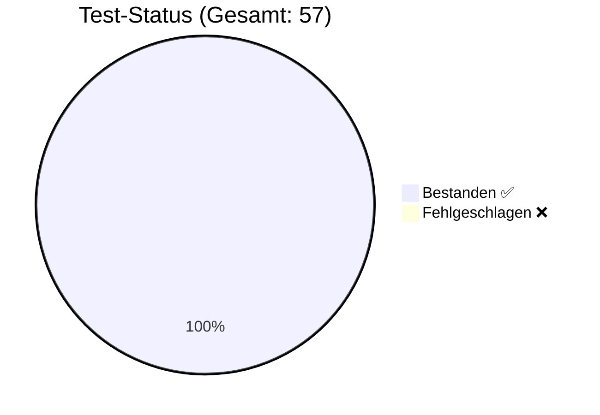

# 🛡️ QA Test Report

**Generiert am**: 27.2.2026, 09:46:07
**Status**: ✅ ALLE TESTS BESTANDEN

## 📊 Visuelle Übersicht

## 🧪 Test-Details
| Test-Fall | Kategorie | Typ | Erwartet | Ergebnis | Status |
| :--- | :--- | :--- | :--- | :--- | :--- |
| TestUser Login | Happy Path | ✅ **Gut-Test** | OK/Erwartet | OK/Erhalten | ✅ |
| Admin Login | Happy Path | ✅ **Gut-Test** | OK/Erwartet | OK/Erhalten | ✅ |
| Bug User Login | Edge Case | 🛡️ **Schlecht-Test** | OK/Erwartet | OK/Erhalten | ✅ |
| Ungültiger PIN | Security | 🛡️ **Schlecht-Test** | Abgelehnt | Abgelehnt | ✅ |
| Teil-Eingabe (Prefix) | Security | 🛡️ **Schlecht-Test** | Abgelehnt | Abgelehnt | ✅ |
| SmartMapping: Root Extraction <small>Path: </small> | Smart Mapping | ✅ **Gut-Test** | OK/Erwartet | OK/Erhalten | ✅ |
| SmartMapping: Single Level <small>Path: success</small> | Smart Mapping | ✅ **Gut-Test** | OK/Erwartet | OK/Erhalten | ✅ |
| SmartMapping: Nested Level <small>Path: data.user</small> | Smart Mapping | ✅ **Gut-Test** | OK/Erwartet | OK/Erhalten | ✅ |
| SmartMapping: Deep Property <small>Path: data.user.name</small> | Smart Mapping | ✅ **Gut-Test** | OK/Erwartet | OK/Erhalten | ✅ |
| SmartMapping: Invalid Path <small>Path: data.unknown</small> | Smart Mapping | ✅ **Gut-Test** | OK/Erwartet | OK/Erhalten | ✅ |
| Discovery: DB Keys found <small>Keys: users, cities, houses, rooms, games, instances</small> | Discovery | ✅ **Gut-Test** | OK/Erwartet | OK/Erhalten | ✅ |
| Discovery: Users collection exists | Discovery | ✅ **Gut-Test** | OK/Erwartet | OK/Erhalten | ✅ |
| Unification: PropertyHelper Traversal <small>Value: Rolf (Expected: 'Rolf')</small> | Smart Mapping | ✅ **Gut-Test** | OK/Erwartet | OK/Erhalten | ✅ |
| Unification: ExpressionParser Interpolation <small>Result: Hello Rolf</small> | Smart Mapping | ✅ **Gut-Test** | OK/Erwartet | OK/Erhalten | ✅ |
| Unification: Source-Level Unwrapping (Sim) <small>Type: object, IsArray: false</small> | Smart Mapping | ✅ **Gut-Test** | OK/Erwartet | OK/Erhalten | ✅ |
| Unification: Deep Path Auto-Unwrap <small>Version: 123</small> | Smart Mapping | ✅ **Gut-Test** | OK/Erwartet | OK/Erhalten | ✅ |
| TTable: Smart-Unwrap TObjectList <small>Data: 1, Cols: 1 (Inherited: Name)</small> | Smart Mapping | ✅ **Gut-Test** | OK/Erwartet | OK/Erhalten | ✅ |
| TTable: Smart-Unwrap TListVariable <small>Data: 2, First: Value 1</small> | Smart Mapping | ✅ **Gut-Test** | OK/Erwartet | OK/Erhalten | ✅ |
| TDataAction: SELECT count(*) Only <small>Expected: 3, Got: 3</small> | Happy Path | ✅ **Gut-Test** | OK/Erwartet | OK/Erhalten | ✅ |
| TDataAction: SELECT id, count(*) <small>Expected: Array(3) with count:1, Got: {"id":1,"count":1}</small> | Happy Path | ✅ **Gut-Test** | OK/Erwartet | OK/Erhalten | ✅ |
| Hydrate: TButton <small>className=TButton, name=TestButton, caption=Klick mich</small> | Serialization | 🛡️ **Schlecht-Test** | OK/Erwartet | OK/Erhalten | ✅ |
| Hydrate: TIntegerVariable <small>className=TIntegerVariable, value=42, isVariable=true</small> | Serialization | 🛡️ **Schlecht-Test** | OK/Erwartet | OK/Erhalten | ✅ |
| Hydrate: isVariable bleibt true <small>isVariable=true</small> | Serialization | 🛡️ **Schlecht-Test** | OK/Erwartet | OK/Erhalten | ✅ |
| Hydrate: Unknown Class (kein Crash) <small>Ergebnis-Länge=0 (erwartet: 0)</small> | Serialization | 🛡️ **Schlecht-Test** | OK/Erwartet | OK/Erhalten | ✅ |
| Hydrate: Round-Trip (toJSON → hydrate) <small>name=MyShape, x=50, text=⭐</small> | Serialization | 🛡️ **Schlecht-Test** | OK/Erwartet | OK/Erhalten | ✅ |
| Hydrate: Container mit Children <small>Children-Anzahl=2, Typen=[TButton, TLabel]</small> | Serialization | 🛡️ **Schlecht-Test** | OK/Erwartet | OK/Erhalten | ✅ |
| Hydrate: Events/Tasks-Fallback <small>events.onClick=DoLogin</small> | Serialization | 🛡️ **Schlecht-Test** | OK/Erwartet | OK/Erhalten | ✅ |
| Hydrate: Style-Merge <small>bgColor=#333, borderRadius=8px</small> | Serialization | 🛡️ **Schlecht-Test** | OK/Erwartet | OK/Erhalten | ✅ |
| Rename Task: AttemptLogin → DoLogin <small>Task=true, Event=true, ObjEvent=true, FlowChart=true</small> | Refactoring | 🛡️ **Schlecht-Test** | OK/Erwartet | OK/Erhalten | ✅ |
| Rename Action: ValidatePin → CheckPinCode <small>Action=true, Sequence=true, Flow=false</small> | Refactoring | 🛡️ **Schlecht-Test** | OK/Erwartet | OK/Erhalten | ✅ |
| Rename Variable: currentUser → activeUser <small>Var=true, Formula=true, ResultVar=true</small> | Refactoring | 🛡️ **Schlecht-Test** | OK/Erwartet | OK/Erhalten | ✅ |
| Rename Object: LoginButton → SignInButton <small>Object=true, ActionTarget=true</small> | Refactoring | 🛡️ **Schlecht-Test** | OK/Erwartet | OK/Erhalten | ✅ |
| Delete Task: AttemptLogin <small>TaskGone=true, EventCleared=true, FlowChartGone=true</small> | Refactoring | 🛡️ **Schlecht-Test** | OK/Erwartet | OK/Erhalten | ✅ |
| Delete Action: SetupVars <small>ActionGone=true, SequenceCleaned=true</small> | Refactoring | 🛡️ **Schlecht-Test** | OK/Erwartet | OK/Erhalten | ✅ |
| Delete Variable: pin <small>VariableGone=true</small> | Refactoring | 🛡️ **Schlecht-Test** | OK/Erwartet | OK/Erhalten | ✅ |
| Usage Report: AttemptLogin <small>Referenzen=1, Orte=1</small> | Refactoring | 🛡️ **Schlecht-Test** | OK/Erwartet | OK/Erhalten | ✅ |
| Sanitize: Root-Duplikate entfernt <small>Root-Tasks nach Sanitize=0</small> | Refactoring | 🛡️ **Schlecht-Test** | OK/Erwartet | OK/Erhalten | ✅ |
| Execute: Stage-Task → 1 Action <small>Ausgeführt: [StageAction]</small> | TaskExecutor | 🛡️ **Schlecht-Test** | OK/Erwartet | OK/Erhalten | ✅ |
| Execute: Blueprint-Lookup (Hierarchie) <small>Ausgeführt: [GlobalAction1, GlobalAction2]</small> | TaskExecutor | 🛡️ **Schlecht-Test** | OK/Erwartet | OK/Erhalten | ✅ |
| Execute: Unbekannter Task (kein Crash) <small>Ausgeführt: 0 (erwartet: 0)</small> | TaskExecutor | 🛡️ **Schlecht-Test** | OK/Erwartet | OK/Erhalten | ✅ |
| Execute: Action Resolution (Name → Definition) <small>Target=LoginBtn (erwartet: LoginBtn)</small> | TaskExecutor | 🛡️ **Schlecht-Test** | OK/Erwartet | OK/Erhalten | ✅ |
| Execute: Condition TRUE → thenTask <small>Ausgeführt: [StageAction]</small> | TaskExecutor | 🛡️ **Schlecht-Test** | OK/Erwartet | OK/Erhalten | ✅ |
| Execute: Condition FALSE → elseTask <small>Ausgeführt: [GlobalAction1, GlobalAction2]</small> | TaskExecutor | 🛡️ **Schlecht-Test** | OK/Erwartet | OK/Erhalten | ✅ |
| Execute: Max Recursion Depth Guard <small>Kein Endlos-Loop</small> | TaskExecutor | 🛡️ **Schlecht-Test** | OK/Erwartet | OK/Erhalten | ✅ |
| FlowSync: Elemente = Sequence-Länge <small>Flow-Actions=2, Sequence=2</small> | FlowSync | 🛡️ **Schlecht-Test** | OK/Erwartet | OK/Erhalten | ✅ |
| FlowSync: Action-Namen konsistent <small>Flow=[ResetScore,ShowWelcome], Seq=[ResetScore,ShowWelcome]</small> | FlowSync | 🛡️ **Schlecht-Test** | OK/Erwartet | OK/Erhalten | ✅ |
| FlowSync: Keine Blueprint/Stage Task-Duplikate <small>Duplikate=[]</small> | FlowSync | 🛡️ **Schlecht-Test** | OK/Erwartet | OK/Erhalten | ✅ |
| FlowSync: Connections referenzieren gültige Elemente <small>Alle Connections gültig</small> | FlowSync | 🛡️ **Schlecht-Test** | OK/Erwartet | OK/Erhalten | ✅ |
| FlowSync: Korrupte Task-Daten erkannt <small>Gefunden: 2 korrupte Einträge</small> | FlowSync | 🛡️ **Schlecht-Test** | OK/Erwartet | OK/Erhalten | ✅ |
| Projekt laden <small>Stages: 9</small> | Integrity | 🛡️ **Schlecht-Test** | OK/Erwartet | OK/Erhalten | ✅ |
| Integrität: Keine verwaisten FlowCharts <small>Alle FlowCharts haben Tasks</small> | Integrity | 🛡️ **Schlecht-Test** | OK/Erwartet | OK/Erhalten | ✅ |
| Integrität: Keine Task-Duplikate <small>Keine Duplikate</small> | Integrity | 🛡️ **Schlecht-Test** | OK/Erwartet | OK/Erhalten | ✅ |
| Integrität: Event→Task-Mappings gültig <small>Alle Mappings OK</small> | Integrity | 🛡️ **Schlecht-Test** | OK/Erwartet | OK/Erhalten | ✅ |
| Integrität: Actions in Sequences definiert <small>Alle Actions gefunden</small> | Integrity | 🛡️ **Schlecht-Test** | OK/Erwartet | OK/Erhalten | ✅ |
| Integrität: Blueprint-Stage vorhanden <small>stage_blueprint gefunden</small> | Integrity | 🛡️ **Schlecht-Test** | OK/Erwartet | OK/Erhalten | ✅ |
| Integrität: Keine korrupten Task-Einträge <small>Alle Task-Namen gültig</small> | Integrity | 🛡️ **Schlecht-Test** | OK/Erwartet | OK/Erhalten | ✅ |
| Integrität: Keine Inline-Actions <small>Alle Sequences nutzen Referenzen</small> | Integrity | 🛡️ **Schlecht-Test** | OK/Erwartet | OK/Erhalten | ✅ |

---
*Hinweis: Dieser Bericht wurde automatisch vom GCS Regression Test Runner erstellt.*