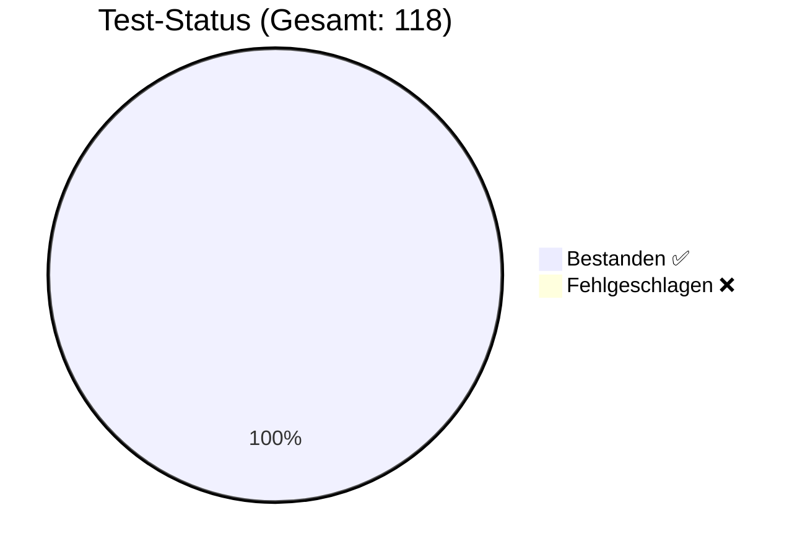

# 🛡️ QA Test Report

**Generiert am**: 17.3.2026, 22:04:22
**Status**: ✅ ALLE TESTS BESTANDEN

## 📊 Visuelle Übersicht

## 🧪 Test-Details
| Test-Fall | Kategorie | Typ | Erwartet | Ergebnis | Status |
| :--- | :--- | :--- | :--- | :--- | :--- |
| TestUser Login | Happy Path | ✅ **Gut-Test** | OK/Erwartet | OK/Erhalten | ✅ |
| Admin Login | Happy Path | ✅ **Gut-Test** | OK/Erwartet | OK/Erhalten | ✅ |
| Bug User Login | Edge Case | 🛡️ **Schlecht-Test** | OK/Erwartet | OK/Erhalten | ✅ |
| Ungültiger PIN | Security | 🛡️ **Schlecht-Test** | Abgelehnt | Abgelehnt | ✅ |
| Teil-Eingabe (Prefix) | Security | 🛡️ **Schlecht-Test** | Abgelehnt | Abgelehnt | ✅ |
| SmartMapping: Root Extraction <small>Path: </small> | Smart Mapping | ✅ **Gut-Test** | OK/Erwartet | OK/Erhalten | ✅ |
| SmartMapping: Single Level <small>Path: success</small> | Smart Mapping | ✅ **Gut-Test** | OK/Erwartet | OK/Erhalten | ✅ |
| SmartMapping: Nested Level <small>Path: data.user</small> | Smart Mapping | ✅ **Gut-Test** | OK/Erwartet | OK/Erhalten | ✅ |
| SmartMapping: Deep Property <small>Path: data.user.name</small> | Smart Mapping | ✅ **Gut-Test** | OK/Erwartet | OK/Erhalten | ✅ |
| SmartMapping: Invalid Path <small>Path: data.unknown</small> | Smart Mapping | ✅ **Gut-Test** | OK/Erwartet | OK/Erhalten | ✅ |
| Discovery: DB Keys found <small>Keys: users, cities, houses, rooms, games, instances</small> | Discovery | ✅ **Gut-Test** | OK/Erwartet | OK/Erhalten | ✅ |
| Discovery: Users collection exists | Discovery | ✅ **Gut-Test** | OK/Erwartet | OK/Erhalten | ✅ |
| Unification: PropertyHelper Traversal <small>Value: Rolf (Expected: 'Rolf')</small> | Smart Mapping | ✅ **Gut-Test** | OK/Erwartet | OK/Erhalten | ✅ |
| Unification: ExpressionParser Interpolation <small>Result: Hello Rolf</small> | Smart Mapping | ✅ **Gut-Test** | OK/Erwartet | OK/Erhalten | ✅ |
| Unification: Source-Level Unwrapping (Sim) <small>Type: object, IsArray: false</small> | Smart Mapping | ✅ **Gut-Test** | OK/Erwartet | OK/Erhalten | ✅ |
| Unification: Deep Path Auto-Unwrap <small>Version: 123</small> | Smart Mapping | ✅ **Gut-Test** | OK/Erwartet | OK/Erhalten | ✅ |
| TTable: Smart-Unwrap TObjectList <small>Data: 1, Cols: 1 (Inherited: Name)</small> | Smart Mapping | ✅ **Gut-Test** | OK/Erwartet | OK/Erhalten | ✅ |
| TTable: Smart-Unwrap TListVariable <small>Data: 2, First: Value 1</small> | Smart Mapping | ✅ **Gut-Test** | OK/Erwartet | OK/Erhalten | ✅ |
| TDataAction: SELECT count(*) Only <small>Expected: 3, Got: 3</small> | Happy Path | ✅ **Gut-Test** | OK/Erwartet | OK/Erhalten | ✅ |
| TDataAction: SELECT id, count(*) <small>Expected: Array(3) with count:1, Got: {"id":1,"count":1}</small> | Happy Path | ✅ **Gut-Test** | OK/Erwartet | OK/Erhalten | ✅ |
| Action-Registrierung beim Drop <small>Action gefunden, Target=Box1</small> | ActionRegistration | 🛡️ **Schlecht-Test** | OK/Erwartet | OK/Erhalten | ✅ |
| Global Scope Handling <small>In Projekt-Aktionen gefunden</small> | ActionRegistration | 🛡️ **Schlecht-Test** | OK/Erwartet | OK/Erhalten | ✅ |
| Action Create <small>Action erfolgreich in Blueprint-Stage erstellt.</small> | ActionCRUD | 🛡️ **Schlecht-Test** | OK/Erwartet | OK/Erhalten | ✅ |
| Action Read <small>Action-Eigenschaften korrekt gelesen.</small> | ActionCRUD | 🛡️ **Schlecht-Test** | OK/Erwartet | OK/Erhalten | ✅ |
| Action Update (Rename) <small>Refactoring erfolgreich: Task & FlowChart aktualisiert.</small> | ActionCRUD | 🛡️ **Schlecht-Test** | OK/Erwartet | OK/Erhalten | ✅ |
| Action Delete <small>Aktion (Normal & Data) restlos entfernt.</small> | ActionCRUD | 🛡️ **Schlecht-Test** | OK/Erwartet | OK/Erhalten | ✅ |
| should resolve numeric bindings in x and y coordinates | Happy Path | ✅ **Gut-Test** | OK/Erwartet | OK/Erhalten | ✅ |
| should resolve numeric bindings in width and height | Happy Path | ✅ **Gut-Test** | OK/Erwartet | OK/Erhalten | ✅ |
| should handle nested math in coordinates | Happy Path | ✅ **Gut-Test** | OK/Erwartet | OK/Erhalten | ✅ |
| addTaskCall — Gutfall <small>Task-Referenz korrekt eingefügt.</small> | AgentController | 🛡️ **Schlecht-Test** | OK/Erwartet | OK/Erhalten | ✅ |
| addTaskCall — Schlechtfall <small>Fehler korrekt geworfen.</small> | AgentController | 🛡️ **Schlecht-Test** | OK/Erwartet | OK/Erhalten | ✅ |
| setTaskTriggerMode — Gutfall <small>TriggerMode korrekt gesetzt.</small> | AgentController | 🛡️ **Schlecht-Test** | OK/Erwartet | OK/Erhalten | ✅ |
| setTaskTriggerMode — Schlechtfall <small>Fehler korrekt geworfen.</small> | AgentController | 🛡️ **Schlecht-Test** | OK/Erwartet | OK/Erhalten | ✅ |
| addTaskParam — Gutfall <small>2 Parameter korrekt hinzugefügt.</small> | AgentController | 🛡️ **Schlecht-Test** | OK/Erwartet | OK/Erhalten | ✅ |
| addTaskParam — Update <small>Param aktualisiert, kein Duplikat.</small> | AgentController | 🛡️ **Schlecht-Test** | OK/Erwartet | OK/Erhalten | ✅ |
| moveActionInSequence — Gutfall <small>Reihenfolge korrekt: B, C, A.</small> | AgentController | 🛡️ **Schlecht-Test** | OK/Erwartet | OK/Erhalten | ✅ |
| moveActionInSequence — Schlechtfall <small>Fehler korrekt geworfen.</small> | AgentController | 🛡️ **Schlecht-Test** | OK/Erwartet | OK/Erhalten | ✅ |
| Integration: PingPong via API <small>Vollständiges PingPong erstellt: 5 Objekte, 3 Tasks, 2 Variablen, Events gebunden. Validierung: 3 Warnungen, 0 Fehler.</small> | AgentController | 🛡️ **Schlecht-Test** | OK/Erwartet | OK/Erhalten | ✅ |
| executeBatch — Gutfall <small>4 Ops erfolgreich: Variable + Task + Action + TriggerMode.</small> | AgentController | 🛡️ **Schlecht-Test** | OK/Erwartet | OK/Erhalten | ✅ |
| executeBatch — Rollback <small>Fehler erkannt + Variable rollbacked.</small> | AgentController | 🛡️ **Schlecht-Test** | OK/Erwartet | OK/Erhalten | ✅ |
| Integration: Tennis via Batch <small>Tennis-Spiel komplett: 20 Batch-Ops, 3 Stages, 6 Objekte, 3 Tasks, 3 Variablen, Events gebunden, Validierung OK.</small> | AgentController | 🛡️ **Schlecht-Test** | OK/Erwartet | OK/Erhalten | ✅ |
| Hydrate: TButton <small>className=TButton, name=TestButton, caption=Klick mich</small> | Serialization | 🛡️ **Schlecht-Test** | OK/Erwartet | OK/Erhalten | ✅ |
| Hydrate: TIntegerVariable <small>className=TIntegerVariable, value=42, isVariable=true</small> | Serialization | 🛡️ **Schlecht-Test** | OK/Erwartet | OK/Erhalten | ✅ |
| Hydrate: isVariable bleibt true <small>isVariable=true</small> | Serialization | 🛡️ **Schlecht-Test** | OK/Erwartet | OK/Erhalten | ✅ |
| Hydrate: Unknown Class (kein Crash) <small>Ergebnis-Länge=0 (erwartet: 0)</small> | Serialization | 🛡️ **Schlecht-Test** | OK/Erwartet | OK/Erhalten | ✅ |
| Hydrate: Round-Trip (toJSON → hydrate) <small>name=MyShape, x=50, text=⭐</small> | Serialization | 🛡️ **Schlecht-Test** | OK/Erwartet | OK/Erhalten | ✅ |
| Hydrate: Container mit Children <small>Children-Anzahl=2, Typen=[TButton, TLabel]</small> | Serialization | 🛡️ **Schlecht-Test** | OK/Erwartet | OK/Erhalten | ✅ |
| Hydrate: Events/Tasks-Fallback <small>events.onClick=DoLogin</small> | Serialization | 🛡️ **Schlecht-Test** | OK/Erwartet | OK/Erhalten | ✅ |
| Hydrate: Style-Merge <small>bgColor=#333, borderRadius=8px</small> | Serialization | 🛡️ **Schlecht-Test** | OK/Erwartet | OK/Erhalten | ✅ |
| Rename Task: AttemptLogin → DoLogin <small>Task=true, Event=true, ObjEvent=true, FlowChart=true</small> | Refactoring | 🛡️ **Schlecht-Test** | OK/Erwartet | OK/Erhalten | ✅ |
| Rename Action: ValidatePin → CheckPinCode <small>Action=true, Sequence=true, Flow=false</small> | Refactoring | 🛡️ **Schlecht-Test** | OK/Erwartet | OK/Erhalten | ✅ |
| Rename Variable: currentUser → activeUser <small>Var=true, Formula=true, ResultVar=true</small> | Refactoring | 🛡️ **Schlecht-Test** | OK/Erwartet | OK/Erhalten | ✅ |
| Rename Object: LoginButton → SignInButton <small>Object=true, ActionTarget=true</small> | Refactoring | 🛡️ **Schlecht-Test** | OK/Erwartet | OK/Erhalten | ✅ |
| Delete Task: AttemptLogin <small>TaskGone=true, EventCleared=true, FlowChartGone=true, ObjEventCleared=true</small> | Refactoring | 🛡️ **Schlecht-Test** | OK/Erwartet | OK/Erhalten | ✅ |
| Delete Action: SetupVars <small>ActionGone=true, SequenceCleaned=true</small> | Refactoring | 🛡️ **Schlecht-Test** | OK/Erwartet | OK/Erhalten | ✅ |
| Delete Variable: pin <small>VariableGone=true</small> | Refactoring | 🛡️ **Schlecht-Test** | OK/Erwartet | OK/Erhalten | ✅ |
| Usage Report: AttemptLogin <small>Referenzen=1, Orte=1</small> | Refactoring | 🛡️ **Schlecht-Test** | OK/Erwartet | OK/Erhalten | ✅ |
| Sanitize: Root-Duplikate entfernt <small>Root-Tasks nach Sanitize=0</small> | Refactoring | 🛡️ **Schlecht-Test** | OK/Erwartet | OK/Erhalten | ✅ |
| Execute: Stage-Task → 1 Action <small>Ausgeführt: [StageAction]</small> | TaskExecutor | 🛡️ **Schlecht-Test** | OK/Erwartet | OK/Erhalten | ✅ |
| Execute: Blueprint-Lookup (Hierarchie) <small>Ausgeführt: [GlobalAction1, GlobalAction2]</small> | TaskExecutor | 🛡️ **Schlecht-Test** | OK/Erwartet | OK/Erhalten | ✅ |
| Execute: Unbekannter Task (kein Crash) <small>Ausgeführt: 0 (erwartet: 0)</small> | TaskExecutor | 🛡️ **Schlecht-Test** | OK/Erwartet | OK/Erhalten | ✅ |
| Execute: Action Resolution (Name → Definition) <small>Target=LoginBtn (erwartet: LoginBtn)</small> | TaskExecutor | 🛡️ **Schlecht-Test** | OK/Erwartet | OK/Erhalten | ✅ |
| Execute: Condition TRUE → thenTask <small>Ausgeführt: [StageAction]</small> | TaskExecutor | 🛡️ **Schlecht-Test** | OK/Erwartet | OK/Erhalten | ✅ |
| Execute: Condition FALSE → elseTask <small>Ausgeführt: [GlobalAction1, GlobalAction2]</small> | TaskExecutor | 🛡️ **Schlecht-Test** | OK/Erwartet | OK/Erhalten | ✅ |
| Execute: Max Recursion Depth Guard <small>Kein Endlos-Loop</small> | TaskExecutor | 🛡️ **Schlecht-Test** | OK/Erwartet | OK/Erhalten | ✅ |
| FlowSync: Elemente = Sequence-Länge <small>Flow-Actions=2, Sequence=2</small> | FlowSync | 🛡️ **Schlecht-Test** | OK/Erwartet | OK/Erhalten | ✅ |
| FlowSync: Action-Namen konsistent <small>Flow=[ResetScore,ShowWelcome], Seq=[ResetScore,ShowWelcome]</small> | FlowSync | 🛡️ **Schlecht-Test** | OK/Erwartet | OK/Erhalten | ✅ |
| FlowSync: Keine Blueprint/Stage Task-Duplikate <small>Duplikate=[]</small> | FlowSync | 🛡️ **Schlecht-Test** | OK/Erwartet | OK/Erhalten | ✅ |
| FlowSync: Connections referenzieren gültige Elemente <small>Alle Connections gültig</small> | FlowSync | 🛡️ **Schlecht-Test** | OK/Erwartet | OK/Erhalten | ✅ |
| FlowSync: Korrupte Task-Daten erkannt <small>Gefunden: 2 korrupte Einträge</small> | FlowSync | 🛡️ **Schlecht-Test** | OK/Erwartet | OK/Erhalten | ✅ |
| Projekt laden <small>Stages: 4</small> | Integrity | 🛡️ **Schlecht-Test** | OK/Erwartet | OK/Erhalten | ✅ |
| Integrität: Keine verwaisten FlowCharts <small>Alle FlowCharts haben Tasks</small> | Integrity | 🛡️ **Schlecht-Test** | OK/Erwartet | OK/Erhalten | ✅ |
| Integrität: Keine Task-Duplikate <small>Keine Duplikate</small> | Integrity | 🛡️ **Schlecht-Test** | OK/Erwartet | OK/Erhalten | ✅ |
| Integrität: Event→Task-Mappings gültig <small>Alle Mappings OK</small> | Integrity | 🛡️ **Schlecht-Test** | OK/Erwartet | OK/Erhalten | ✅ |
| Integrität: Actions in Sequences definiert <small>Alle Actions gefunden</small> | Integrity | 🛡️ **Schlecht-Test** | OK/Erwartet | OK/Erhalten | ✅ |
| Integrität: Blueprint-Stage vorhanden <small>stage_blueprint gefunden</small> | Integrity | 🛡️ **Schlecht-Test** | OK/Erwartet | OK/Erhalten | ✅ |
| Integrität: Keine korrupten Task-Einträge <small>Alle Task-Namen gültig</small> | Integrity | 🛡️ **Schlecht-Test** | OK/Erwartet | OK/Erhalten | ✅ |
| Integrität: Keine Inline-Actions <small>Alle Sequences nutzen Referenzen</small> | Integrity | 🛡️ **Schlecht-Test** | OK/Erwartet | OK/Erhalten | ✅ |
| Multi-Feld-Matching: Erfasst teil-aktualisierte Knoten <small>data.taskName=SolidTask, properties.name=SolidTask</small> | Robustness | 🛡️ **Schlecht-Test** | OK/Erwartet | OK/Erhalten | ✅ |
| Condition-Update: thenTask/elseTask Referenzen <small>thenTask=SolidTask</small> | Robustness | 🛡️ **Schlecht-Test** | OK/Erwartet | OK/Erhalten | ✅ |
| Case-Insensitivity: Erkennt "task" und "TASK" <small>lower=New, upper=New2</small> | Robustness | 🛡️ **Schlecht-Test** | OK/Erwartet | OK/Erhalten | ✅ |
| R0: Sauberes Projekt → 0 Verletzungen <small>Keine Verletzungen</small> | SyncValidator | 🛡️ **Schlecht-Test** | OK/Erwartet | OK/Erhalten | ✅ |
| R1: Verwaiste Action-Referenz erkennen <small>Erkannt: Task "BlueprintTask": 1 verwaiste Action-Referenz(en): [NichtExistierendeAction]</small> | SyncValidator | 🛡️ **Schlecht-Test** | OK/Erwartet | OK/Erhalten | ✅ |
| R1: Auto-Repair entfernt verwaiste Referenz <small>Vorher: 2, Nachher: 1</small> | SyncValidator | 🛡️ **Schlecht-Test** | OK/Erwartet | OK/Erhalten | ✅ |
| R2: FlowChart ohne Task erkennen <small>Erkannt: Stage "MainStage": FlowChart "PhantomTask" hat keine zugehörige Task-Definition.</small> | SyncValidator | 🛡️ **Schlecht-Test** | OK/Erwartet | OK/Erhalten | ✅ |
| R2: Auto-Repair entfernt verwaisten FlowChart <small>PhantomTask-Schlüssel entfernt</small> | SyncValidator | 🛡️ **Schlecht-Test** | OK/Erwartet | OK/Erhalten | ✅ |
| R3: Kaputte Connection erkennen <small>Erkannt: Flow "BlueprintTask": Connection "broken-conn" zeigt auf nicht-existierenden Start-Node "non-existent-node".</small> | SyncValidator | 🛡️ **Schlecht-Test** | OK/Erwartet | OK/Erhalten | ✅ |
| R5: Task-Duplikat erkennen <small>Erkannt: Task "BlueprintTask" existiert doppelt: in Stage "MainStage" und in Stage "Blueprint".</small> | SyncValidator | 🛡️ **Schlecht-Test** | OK/Erwartet | OK/Erhalten | ✅ |
| R6: FlowChart Split-Brain erkennen <small>Erkannt: FlowChart "BlueprintTask" existiert sowohl in Root als auch in Stage "Blueprint" — Split-Brain!</small> | SyncValidator | 🛡️ **Schlecht-Test** | OK/Erwartet | OK/Erhalten | ✅ |
| R6: Auto-Repair entfernt Root-Duplikat <small>Root-FlowChart entfernt, Stage-Version behalten</small> | SyncValidator | 🛡️ **Schlecht-Test** | OK/Erwartet | OK/Erhalten | ✅ |
| Spot-Validierung: Konsistentes Objekt → 0 Verletzungen <small>Keine Desync</small> | SyncValidator | 🛡️ **Schlecht-Test** | OK/Erwartet | OK/Erhalten | ✅ |
| SnapshotManager Tests | Undo/Redo | 🛡️ **Schlecht-Test** | OK/Erwartet | OK/Erhalten | ✅ |
| ProjectStore Tests | State-Management | 🛡️ **Schlecht-Test** | OK/Erwartet | OK/Erhalten | ✅ |
| Inspector enthält selectFields <small>selectFields: vorhanden</small> | FlowDataAction | 🛡️ **Schlecht-Test** | OK/Erwartet | OK/Erhalten | ✅ |
| Sektionen-Reihenfolge korrekt <small>Erwartet: Allgemein → FROM / Datenquelle → SELECT / Felder → INTO / Ergebnis → WHERE / Filter → HTTP / Request → Aktionen, Gefunden: Allgemein → FROM / Datenquelle → SELECT / Felder → INTO / Ergebnis → WHERE / Filter → HTTP / Request → Aktionen</small> | FlowDataAction | 🛡️ **Schlecht-Test** | OK/Erwartet | OK/Erhalten | ✅ |
| dataStore source=dataStores <small>Source: dataStores</small> | FlowDataAction | 🛡️ **Schlecht-Test** | OK/Erwartet | OK/Erhalten | ✅ |
| queryProperty source=dataStoreFields <small>Source: dataStoreFields</small> | FlowDataAction | 🛡️ **Schlecht-Test** | OK/Erwartet | OK/Erhalten | ✅ |
| queryProperty type=select <small>Type: select</small> | FlowDataAction | 🛡️ **Schlecht-Test** | OK/Erwartet | OK/Erhalten | ✅ |
| resultVariable in INTO-Sektion <small>Sektion: INTO / Ergebnis</small> | FlowDataAction | 🛡️ **Schlecht-Test** | OK/Erwartet | OK/Erhalten | ✅ |
| GROUP_COLORS Mapping <small>Einträge: 29, FROM: true, WHERE: true</small> | FlowDataAction | 🛡️ **Schlecht-Test** | OK/Erwartet | OK/Erhalten | ✅ |
| Erweiterte Operatoren (CONTAINS, IN) <small>CONTAINS: true, IN: true</small> | FlowDataAction | 🛡️ **Schlecht-Test** | OK/Erwartet | OK/Erhalten | ✅ |
| Export-Integrität: GameExporter.ts | Export-Integrität | 🛡️ **Schlecht-Test** | OK/Erwartet | OK/Erhalten | ✅ |
| Export-Integrität: ProjectPersistenceService.ts | Export-Integrität | 🛡️ **Schlecht-Test** | OK/Erwartet | OK/Erhalten | ✅ |
| Export-Integrität: player-standalone.ts | Export-Integrität | 🛡️ **Schlecht-Test** | OK/Erwartet | OK/Erhalten | ✅ |
| Export-Integrität: GameRuntime.ts | Export-Integrität | 🛡️ **Schlecht-Test** | OK/Erwartet | OK/Erhalten | ✅ |
| Export-Integrität: GameLoopManager.ts | Export-Integrität | 🛡️ **Schlecht-Test** | OK/Erwartet | OK/Erhalten | ✅ |
| E2E: Kompletter Flow: Erzeugung, Metadata, Dirty-Check, Stages & Grid <small>Browser: chromium</small> | E2E Browser | 🛡️ **Schlecht-Test** | OK/Erwartet | OK/Erhalten | ✅ |
| E2E: Kompletter Flow: Task erzeugen, umbenennen und Action hinzufügen <small>Browser: chromium</small> | E2E Browser | 🛡️ **Schlecht-Test** | OK/Erwartet | OK/Erhalten | ✅ |
| E2E: Kompletter Flow: Action erzeugen und via Inspector umbenennen <small>Browser: chromium</small> | E2E Browser | 🛡️ **Schlecht-Test** | OK/Erwartet | OK/Erhalten | ✅ |
| E2E: Kompletter Flow: Task→Action Verbindung per Anchor-Drag herstellen <small>Browser: chromium</small> | E2E Browser | 🛡️ **Schlecht-Test** | OK/Erwartet | OK/Erhalten | ✅ |
| E2E: Kompletter Flow: Neue Stage über Menü erzeugen <small>Browser: chromium</small> | E2E Browser | 🛡️ **Schlecht-Test** | OK/Erwartet | OK/Erhalten | ✅ |
| E2E: Kompletter Flow: Action-Typ auf navigate_stage ändern <small>Browser: chromium</small> | E2E Browser | 🛡️ **Schlecht-Test** | OK/Erwartet | OK/Erhalten | ✅ |
| E2E: Kompletter Flow: Button auf MainStage erzeugen und mit run beschriften <small>Browser: chromium</small> | E2E Browser | 🛡️ **Schlecht-Test** | OK/Erwartet | OK/Erhalten | ✅ |
| E2E: MyCoolGame.json auf Disk vollständig validieren <small>Browser: chromium</small> | E2E Browser | 🛡️ **Schlecht-Test** | OK/Erwartet | OK/Erhalten | ✅ |
| E2E: Roundtrip: Werte bleiben nach Speichern und Laden konsistent <small>Browser: chromium</small> | E2E Browser | 🛡️ **Schlecht-Test** | OK/Erwartet | OK/Erhalten | ✅ |
| E2E: sollte den Editor korrekt laden <small>Browser: chromium</small> | E2E Browser | 🛡️ **Schlecht-Test** | OK/Erwartet | OK/Erhalten | ✅ |
| E2E: sollte zwischen Views umschalten können <small>Browser: chromium</small> | E2E Browser | 🛡️ **Schlecht-Test** | OK/Erwartet | OK/Erhalten | ✅ |
| E2E: sollte die Komponenten-Palette in der Toolbox anzeigen <small>Browser: chromium</small> | E2E Browser | 🛡️ **Schlecht-Test** | OK/Erwartet | OK/Erhalten | ✅ |

---
*Hinweis: Dieser Bericht wurde automatisch vom GCS Regression Test Runner erstellt.*