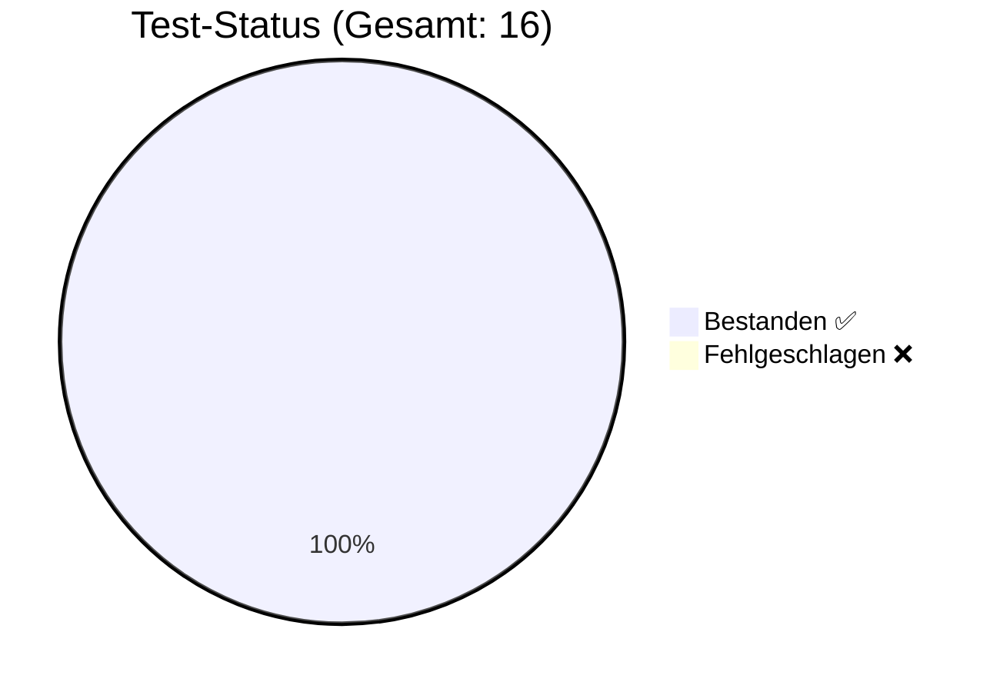

# 🛡️ QA Test Report

**Generiert am**: 19.2.2026, 20:07:04
**Status**: ✅ ALLE TESTS BESTANDEN

## 📊 Visuelle Übersicht

## 🧪 Test-Details
| Test-Fall | Kategorie | Typ | Erwartet | Ergebnis | Status |
| :--- | :--- | :--- | :--- | :--- | :--- |
| TestUser Login | Happy Path | ✅ **Gut-Test** | OK/Erwartet | OK/Erhalten | ✅ |
| Admin Login | Happy Path | ✅ **Gut-Test** | OK/Erwartet | OK/Erhalten | ✅ |
| Bug User Login | Edge Case | 🛡️ **Schlecht-Test** | OK/Erwartet | OK/Erhalten | ✅ |
| Ungültiger PIN | Security | 🛡️ **Schlecht-Test** | Abgelehnt | Abgelehnt | ✅ |
| Teil-Eingabe (Prefix) | Security | 🛡️ **Schlecht-Test** | Abgelehnt | Abgelehnt | ✅ |
| SmartMapping: Root Extraction <small>Path: </small> | Smart Mapping | ✅ **Gut-Test** | OK/Erwartet | OK/Erhalten | ✅ |
| SmartMapping: Single Level <small>Path: success</small> | Smart Mapping | ✅ **Gut-Test** | OK/Erwartet | OK/Erhalten | ✅ |
| SmartMapping: Nested Level <small>Path: data.user</small> | Smart Mapping | ✅ **Gut-Test** | OK/Erwartet | OK/Erhalten | ✅ |
| SmartMapping: Deep Property <small>Path: data.user.name</small> | Smart Mapping | ✅ **Gut-Test** | OK/Erwartet | OK/Erhalten | ✅ |
| SmartMapping: Invalid Path <small>Path: data.unknown</small> | Smart Mapping | ✅ **Gut-Test** | OK/Erwartet | OK/Erhalten | ✅ |
| Discovery: DB Keys found <small>Keys: users, games, instances</small> | Discovery | ✅ **Gut-Test** | OK/Erwartet | OK/Erhalten | ✅ |
| Discovery: Users collection exists | Discovery | ✅ **Gut-Test** | OK/Erwartet | OK/Erhalten | ✅ |
| Unification: PropertyHelper Traversal <small>Value: Rolf (Expected: 'Rolf')</small> | Smart Mapping | ✅ **Gut-Test** | OK/Erwartet | OK/Erhalten | ✅ |
| Unification: ExpressionParser Interpolation <small>Result: Hello Rolf</small> | Smart Mapping | ✅ **Gut-Test** | OK/Erwartet | OK/Erhalten | ✅ |
| Unification: Source-Level Unwrapping (Sim) <small>Type: object, IsArray: false</small> | Smart Mapping | ✅ **Gut-Test** | OK/Erwartet | OK/Erhalten | ✅ |
| Unification: Deep Path Auto-Unwrap <small>Version: 123</small> | Smart Mapping | ✅ **Gut-Test** | OK/Erwartet | OK/Erhalten | ✅ |

---
*Hinweis: Dieser Bericht wurde automatisch vom GCS Regression Test Runner erstellt.*