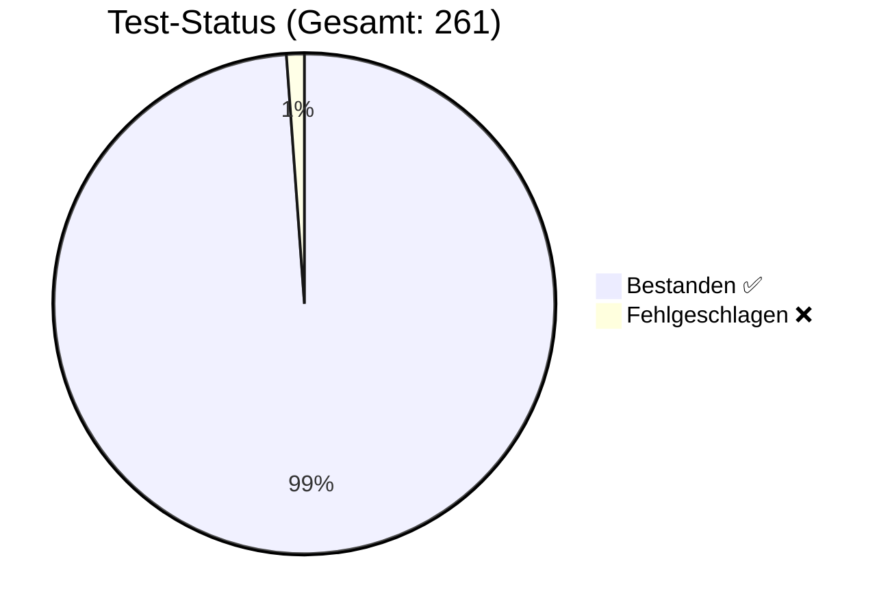

# 🛡️ QA Test Report

**Generiert am**: 11.6.2026, 16:18:04
**Status**: ❌ FEHLER GEFUNDEN
**Gesamtlauf**: 88.0s

## 📊 Visuelle Übersicht

## ⏱ Timing-Übersicht (sortiert nach Dauer)

| Suite | Dauer | Status |
|:---|---:|:---:|
| Playwright E2E | 87739ms 🐌 | ✅ |
| Code Quality & Security Guards | 168ms | ✅ |
| Coordinate Binding | 9ms | ✅ |
| AgentController | 8ms | ✅ |
| Mathe-Quiz | 4ms | ✅ |
| Stage-Transition Regression | 4ms | ✅ |
| RefactoringManager | 3ms | ✅ |
| TaskExecutor | 3ms | ✅ |
| Stage-Import | 2ms | ✅ |
| ProjectStore | 2ms | ✅ |
| SyncValidator | 2ms | ✅ |
| Serialization | 2ms | ✅ |
| SyncRefactor P1: SchemaMigrator | 2ms | ✅ |
| Export Integrity | 2ms | ✅ |
| Project Integrity | 1ms | ✅ |
| GameLoopManager Physics | 1ms | ✅ |
| Action Stage Routing & Duplicates | 1ms | ✅ |
| FlowDataAction Inspector | 1ms | ✅ |
| Action CRUD | 1ms | ✅ |
| Pascal Code Generator | 1ms | ✅ |
| Event Actions (bind/unbind) | 1ms | ✅ |
| Raketen-Countdown | 1ms | ✅ |
| SpawnObject Variable Support | 1ms | ✅ |
| SyncRefactor P0: SyncValidator Strict | 1ms | ✅ |
| SnapshotManager | 1ms | ✅ |
| Action Registration | 1ms | ✅ |
| Unification & Auto-Unwrap | 1ms | ✅ |
| SyncRefactor P0: Store SET_PROPERTY | 1ms | ✅ |
| Virtual Gamepad | 1ms | ✅ |
| SidePanel | 1ms | ✅ |
| TTimer Variable Resolution | 1ms | ✅ |
| SyncRefactor P0: FlowAction Aliases | 1ms | ✅ |
| FlowSync | 1ms | ✅ |
| SyncRefactor P0: Inspector Writeback | 0ms | ✅ |
| Smart-Mapping & Discovery | 0ms | ✅ |
| Login-Logic | 0ms | ✅ |
| Renaming Robustness | 0ms | ✅ |
| Electron Security | 0ms | ✅ |
| Component Events | 0ms | ✅ |
| SELECT COUNT(*) | 0ms | ✅ |
| TTable Smart-Unwrap | 0ms | ✅ |

**Summe Suiten**: 87970ms
**Gesamtlauf inkl. Setup/Report**: 87984ms
**Budget-Warnschwelle**: 180000ms (Einzelsuite 🐌 ab 5000ms)

## 🧪 Test-Details
| Test-Fall | Kategorie | Typ | Erwartet | Ergebnis | Status |
| :--- | :--- | :--- | :--- | :--- | :--- |
| TestUser Login | Happy Path | ✅ **Gut-Test** | OK/Erwartet | OK/Erhalten | ✅ |
| Admin Login | Happy Path | ✅ **Gut-Test** | OK/Erwartet | OK/Erhalten | ✅ |
| Bug User Login | Edge Case | 🛡️ **Schlecht-Test** | OK/Erwartet | OK/Erhalten | ✅ |
| Ungültiger PIN | Security | 🛡️ **Schlecht-Test** | Abgelehnt | Abgelehnt | ✅ |
| Teil-Eingabe (Prefix) | Security | 🛡️ **Schlecht-Test** | Abgelehnt | Abgelehnt | ✅ |
| SmartMapping: Root Extraction <small>Path: </small> | Smart Mapping | ✅ **Gut-Test** | OK/Erwartet | OK/Erhalten | ✅ |
| SmartMapping: Single Level <small>Path: success</small> | Smart Mapping | ✅ **Gut-Test** | OK/Erwartet | OK/Erhalten | ✅ |
| SmartMapping: Nested Level <small>Path: data.user</small> | Smart Mapping | ✅ **Gut-Test** | OK/Erwartet | OK/Erhalten | ✅ |
| SmartMapping: Deep Property <small>Path: data.user.name</small> | Smart Mapping | ✅ **Gut-Test** | OK/Erwartet | OK/Erhalten | ✅ |
| SmartMapping: Invalid Path <small>Path: data.unknown</small> | Smart Mapping | ✅ **Gut-Test** | OK/Erwartet | OK/Erhalten | ✅ |
| Discovery: DB Keys found <small>Keys: users, cities, houses, rooms, games, instances</small> | Discovery | ✅ **Gut-Test** | OK/Erwartet | OK/Erhalten | ✅ |
| Discovery: Users collection exists | Discovery | ✅ **Gut-Test** | OK/Erwartet | OK/Erhalten | ✅ |
| Unification: PropertyHelper Traversal <small>Value: Rolf (Expected: 'Rolf')</small> | Smart Mapping | ✅ **Gut-Test** | OK/Erwartet | OK/Erhalten | ✅ |
| Unification: ExpressionParser Interpolation <small>Result: Hello Rolf</small> | Smart Mapping | ✅ **Gut-Test** | OK/Erwartet | OK/Erhalten | ✅ |
| Unification: Source-Level Unwrapping (Sim) <small>Type: object, IsArray: false</small> | Smart Mapping | ✅ **Gut-Test** | OK/Erwartet | OK/Erhalten | ✅ |
| Unification: Deep Path Auto-Unwrap <small>Version: 123</small> | Smart Mapping | ✅ **Gut-Test** | OK/Erwartet | OK/Erhalten | ✅ |
| TTable: Smart-Unwrap TObjectList <small>Data: 1, Cols: 1 (Inherited: Name)</small> | Smart Mapping | ✅ **Gut-Test** | OK/Erwartet | OK/Erhalten | ✅ |
| TTable: Smart-Unwrap TListVariable <small>Data: 2, First: Value 1</small> | Smart Mapping | ✅ **Gut-Test** | OK/Erwartet | OK/Erhalten | ✅ |
| TDataAction: SELECT count(*) Only <small>Expected: 3, Got: 3</small> | Happy Path | ✅ **Gut-Test** | OK/Erwartet | OK/Erhalten | ✅ |
| TDataAction: SELECT id, count(*) <small>Expected: Array(3) with count:1, Got: {"id":1,"count":1}</small> | Happy Path | ✅ **Gut-Test** | OK/Erwartet | OK/Erhalten | ✅ |
| Action-Registrierung beim Drop <small>Action gefunden, Target=Box1</small> | ActionRegistration | 🛡️ **Schlecht-Test** | OK/Erwartet | OK/Erhalten | ✅ |
| Global Scope Handling <small>In Projekt-Aktionen gefunden</small> | ActionRegistration | 🛡️ **Schlecht-Test** | OK/Erwartet | OK/Erhalten | ✅ |
| Stage-Scope Fix: Action in Task-Stage registriert <small>Action in Stage A gefunden (nicht in Stage B)</small> | ActionRegistration | 🛡️ **Schlecht-Test** | OK/Erwartet | OK/Erhalten | ✅ |
| Action Create <small>Action erfolgreich in Blueprint-Stage erstellt.</small> | ActionCRUD | 🛡️ **Schlecht-Test** | OK/Erwartet | OK/Erhalten | ✅ |
| Action Read <small>Action-Eigenschaften korrekt gelesen.</small> | ActionCRUD | 🛡️ **Schlecht-Test** | OK/Erwartet | OK/Erhalten | ✅ |
| Action Update (Rename) <small>Refactoring erfolgreich: Task & FlowChart aktualisiert.</small> | ActionCRUD | 🛡️ **Schlecht-Test** | OK/Erwartet | OK/Erhalten | ✅ |
| Action Delete <small>Aktion (Normal & Data) restlos entfernt.</small> | ActionCRUD | 🛡️ **Schlecht-Test** | OK/Erwartet | OK/Erhalten | ✅ |
| should resolve numeric bindings in x and y coordinates | Happy Path | ✅ **Gut-Test** | OK/Erwartet | OK/Erhalten | ✅ |
| should resolve numeric bindings in width and height | Happy Path | ✅ **Gut-Test** | OK/Erwartet | OK/Erhalten | ✅ |
| should handle nested math in coordinates | Happy Path | ✅ **Gut-Test** | OK/Erwartet | OK/Erhalten | ✅ |
| GameLoopManager Tests | Physics | 🛡️ **Schlecht-Test** | OK/Erwartet | OK/Erhalten | ✅ |
| addTaskCall — Gutfall <small>Task-Referenz korrekt eingefügt.</small> | AgentController | 🛡️ **Schlecht-Test** | OK/Erwartet | OK/Erhalten | ✅ |
| addTaskCall — Schlechtfall <small>Fehler korrekt geworfen.</small> | AgentController | 🛡️ **Schlecht-Test** | OK/Erwartet | OK/Erhalten | ✅ |
| setTaskTriggerMode — Gutfall <small>TriggerMode korrekt gesetzt.</small> | AgentController | 🛡️ **Schlecht-Test** | OK/Erwartet | OK/Erhalten | ✅ |
| setTaskTriggerMode — Schlechtfall <small>Fehler korrekt geworfen.</small> | AgentController | 🛡️ **Schlecht-Test** | OK/Erwartet | OK/Erhalten | ✅ |
| addTaskParam — Gutfall <small>2 Parameter korrekt hinzugefügt.</small> | AgentController | 🛡️ **Schlecht-Test** | OK/Erwartet | OK/Erhalten | ✅ |
| addTaskParam — Update <small>Param aktualisiert, kein Duplikat.</small> | AgentController | 🛡️ **Schlecht-Test** | OK/Erwartet | OK/Erhalten | ✅ |
| moveActionInSequence — Gutfall <small>Reihenfolge korrekt: B, C, A.</small> | AgentController | 🛡️ **Schlecht-Test** | OK/Erwartet | OK/Erhalten | ✅ |
| moveActionInSequence — Schlechtfall <small>Fehler korrekt geworfen.</small> | AgentController | 🛡️ **Schlecht-Test** | OK/Erwartet | OK/Erhalten | ✅ |
| Integration: PingPong via API <small>Vollständiges PingPong erstellt: 5 Objekte, 3 Tasks, 2 Variablen, Events gebunden. Validierung: 3 Warnungen, 0 Fehler.</small> | AgentController | 🛡️ **Schlecht-Test** | OK/Erwartet | OK/Erhalten | ✅ |
| executeBatch — Gutfall <small>4 Ops erfolgreich: Variable + Task + Action + TriggerMode.</small> | AgentController | 🛡️ **Schlecht-Test** | OK/Erwartet | OK/Erhalten | ✅ |
| executeBatch — Rollback <small>Fehler erkannt + Variable rollbacked.</small> | AgentController | 🛡️ **Schlecht-Test** | OK/Erwartet | OK/Erhalten | ✅ |
| Integration: Tennis via Batch <small>Tennis-Spiel komplett: 20 Batch-Ops, 3 Stages, 6 Objekte, 3 Tasks, 3 Variablen, Events gebunden, Validierung OK.</small> | AgentController | 🛡️ **Schlecht-Test** | OK/Erwartet | OK/Erhalten | ✅ |
| createSprite — Gutfall <small>Sprite mit Physik-Defaults korrekt erstellt.</small> | AgentController | 🛡️ **Schlecht-Test** | OK/Erwartet | OK/Erhalten | ✅ |
| createLabel — Gutfall <small>Label mit Binding + Style korrekt erstellt.</small> | AgentController | 🛡️ **Schlecht-Test** | OK/Erwartet | OK/Erhalten | ✅ |
| setSpriteCollision — Gutfall <small>Collision korrekt gesetzt.</small> | AgentController | 🛡️ **Schlecht-Test** | OK/Erwartet | OK/Erhalten | ✅ |
| setSpriteVelocity — Gutfall <small>Velocity korrekt gesetzt.</small> | AgentController | 🛡️ **Schlecht-Test** | OK/Erwartet | OK/Erhalten | ✅ |
| getComponentSchema — Gutfall <small>TSprite: 18 Props, 12 Events. TTimer: 3 Methods. Unknown: null.</small> | AgentController | 🛡️ **Schlecht-Test** | OK/Erwartet | OK/Erhalten | ✅ |
| Integration: Spiel mit Shortcuts <small>5 Objekte (3 Sprites + 2 Labels), 2 Variablen, 1 Task, Event gebunden.</small> | AgentController | 🛡️ **Schlecht-Test** | OK/Erwartet | OK/Erhalten | ✅ |
| Integration: Raketen-Countdown via Batch <small>Vollständiges Raketen-Demo: 20 Batch-Ops, 4 Objekte, 2 Blueprint-Objekte (GameLoop+GameState), 3 Tasks, 6 Actions, 1 Variable, 3 Events, Binding OK. Validierung: 3 Warnungen, 0 Fehler.</small> | RaketenCountdown | 🛡️ **Schlecht-Test** | OK/Erwartet | OK/Erhalten | ✅ |
| Struktur: Sprite + Task + Action <small>Sprite mit velocityY=0, Task mit set_property Action korrekt erstellt.</small> | RaketenCountdown | 🛡️ **Schlecht-Test** | OK/Erwartet | OK/Erhalten | ✅ |
| Grundstruktur: 2 Stages <small>Blueprint + Quiz</small> | MatheQuiz | 🛡️ **Schlecht-Test** | OK/Erwartet | OK/Erhalten | ✅ |
| Blueprint: GameLoop + GameState <small>GameLoop=true, GameState=true</small> | MatheQuiz | 🛡️ **Schlecht-Test** | OK/Erwartet | OK/Erhalten | ✅ |
| Quiz-Objekte: Random, Score, Timer, Edit <small>Zahl1=true, Zahl2=true, Score=true, Timer=true, Edit=true</small> | MatheQuiz | 🛡️ **Schlecht-Test** | OK/Erwartet | OK/Erhalten | ✅ |
| 5 Tasks vorhanden <small>Tasks: NeueAufgabe, QuizStarten, OnTimerTick, AntwortPruefen, QuizBeenden</small> | MatheQuiz | 🛡️ **Schlecht-Test** | OK/Erwartet | OK/Erhalten | ✅ |
| AntwortPruefen: Condition-Branch <small>Verzweigung für Richtig/Falsch vorhanden</small> | MatheQuiz | 🛡️ **Schlecht-Test** | OK/Erwartet | OK/Erhalten | ✅ |
| Bindings: Zahl1Label + ScoreLabel <small>Zahl1Label.text="${Zahl1}", ScoreLabel.text="${Score}"</small> | MatheQuiz | 🛡️ **Schlecht-Test** | OK/Erwartet | OK/Erhalten | ✅ |
| Events: Start, OK, Timer, GameOver <small>Start=QuizStarten, OK=AntwortPruefen, Timer=OnTimerTick, Max=QuizBeenden</small> | MatheQuiz | 🛡️ **Schlecht-Test** | OK/Erwartet | OK/Erhalten | ✅ |
| TaskCall: QuizStarten → NeueAufgabe <small>Task-Aufruf vorhanden</small> | MatheQuiz | 🛡️ **Schlecht-Test** | OK/Erwartet | OK/Erhalten | ✅ |
| FlowLayouts: Alle 5 Tasks haben Layouts <small>5/5 Tasks mit FlowLayout</small> | MatheQuiz | 🛡️ **Schlecht-Test** | OK/Erwartet | OK/Erhalten | ✅ |
| Validierung: 0 Fehler <small>0 Warnungen, 0 Fehler</small> | MatheQuiz | 🛡️ **Schlecht-Test** | OK/Erwartet | OK/Erhalten | ✅ |
| TVirtualGamepad detects keys from TInputController | VirtualGamepad | 🛡️ **Schlecht-Test** | OK/Erwartet | OK/Erhalten | ✅ |
| TVirtualGamepad property check | VirtualGamepad | 🛡️ **Schlecht-Test** | OK/Erwartet | OK/Erhalten | ✅ |
| Hydrate: TButton <small>className=TButton, name=TestButton, caption=Klick mich</small> | Serialization | 🛡️ **Schlecht-Test** | OK/Erwartet | OK/Erhalten | ✅ |
| Hydrate: TIntegerVariable <small>className=TIntegerVariable, value=42, isVariable=true</small> | Serialization | 🛡️ **Schlecht-Test** | OK/Erwartet | OK/Erhalten | ✅ |
| Hydrate: isVariable bleibt true <small>isVariable=true</small> | Serialization | 🛡️ **Schlecht-Test** | OK/Erwartet | OK/Erhalten | ✅ |
| Hydrate: Unknown Class (kein Crash) <small>Ergebnis-Länge=0 (erwartet: 0)</small> | Serialization | 🛡️ **Schlecht-Test** | OK/Erwartet | OK/Erhalten | ✅ |
| Hydrate: Round-Trip (toJSON → hydrate) <small>name=MyShape, x=50, text=⭐</small> | Serialization | 🛡️ **Schlecht-Test** | OK/Erwartet | OK/Erhalten | ✅ |
| Hydrate: Container mit Children <small>Children-Anzahl=2, Typen=[TButton, TLabel]</small> | Serialization | 🛡️ **Schlecht-Test** | OK/Erwartet | OK/Erhalten | ✅ |
| Hydrate: Events/Tasks-Fallback <small>events.onClick=DoLogin</small> | Serialization | 🛡️ **Schlecht-Test** | OK/Erwartet | OK/Erhalten | ✅ |
| Hydrate: Style-Merge <small>bgColor=#333, borderRadius=8px</small> | Serialization | 🛡️ **Schlecht-Test** | OK/Erwartet | OK/Erhalten | ✅ |
| Hydrate: TSprite ImageList <small>imageListId=imglist_hero, imageIndex=2</small> | Serialization | 🛡️ **Schlecht-Test** | OK/Erwartet | OK/Erhalten | ✅ |
| Hydrate: Prototype Pollution Regression <small>Object.prototype blieb unveraendert</small> | Serialization | 🛡️ **Schlecht-Test** | OK/Erwartet | OK/Erhalten | ✅ |
| Guard: Component Registrierung (Barrel + Registry) <small>Fehlt im Barrel (components/index.ts): TLink</small> | System-Guard | 🛡️ **Schlecht-Test** | OK/Erwartet | Abgelehnt | ❌ |
| Guard: DTO-to-Registry Compliance (T-11b) <small>Alle serialisierbaren Klassen haben eine Factory</small> | System-Guard | 🛡️ **Schlecht-Test** | OK/Erwartet | OK/Erhalten | ✅ |
| Guard: Keine unerlaubten console.* Aufrufe <small>Erlaubt (Baseline 32), Aktuell: 0</small> | System-Guard | 🛡️ **Schlecht-Test** | OK/Erwartet | OK/Erhalten | ✅ |
| Guard: Dateigroesse < 1000 Zeilen <small>Zu gross: src/components/TDebugLog.ts (1003), src/editor/Editor.ts (1223), src/editor/inspector/InspectorRenderer.ts (1273), src/editor/inspector/renderers/InspectorSectionRenderer.ts (1068), src/editor/services/FlowContextMenuProvider.ts (1030), src/editor/services/StageRenderer.ts (1264), src/runtime/GameRuntime.ts (1179), src/services/AgentController.ts (1402)</small> | System-Guard | 🛡️ **Schlecht-Test** | OK/Erwartet | Abgelehnt | ❌ |
| Guard: bundle:runtime Freshness <small>Bundle aktuell</small> | System-Guard | 🛡️ **Schlecht-Test** | OK/Erwartet | OK/Erhalten | ✅ |
| Guard: Kein new Function() RCE-Risiko <small>Sauber</small> | System-Guard | 🛡️ **Schlecht-Test** | OK/Erwartet | OK/Erhalten | ✅ |
| Rename Task: AttemptLogin → DoLogin <small>Task=true, Event=true, ObjEvent=true, FlowChart=true</small> | Refactoring | 🛡️ **Schlecht-Test** | OK/Erwartet | OK/Erhalten | ✅ |
| Rename Action: ValidatePin → CheckPinCode <small>Action=true, Sequence=true, Flow=false</small> | Refactoring | 🛡️ **Schlecht-Test** | OK/Erwartet | OK/Erhalten | ✅ |
| Rename Variable: currentUser → activeUser <small>Var=true, Formula=true, ResultVar=true</small> | Refactoring | 🛡️ **Schlecht-Test** | OK/Erwartet | OK/Erhalten | ✅ |
| Rename Object: LoginButton → SignInButton <small>Object=true, ActionTarget=true</small> | Refactoring | 🛡️ **Schlecht-Test** | OK/Erwartet | OK/Erhalten | ✅ |
| Delete Task: AttemptLogin <small>TaskGone=true, EventCleared=true, FlowChartGone=true, ObjEventCleared=true</small> | Refactoring | 🛡️ **Schlecht-Test** | OK/Erwartet | OK/Erhalten | ✅ |
| Delete Action: SetupVars <small>ActionGone=true, SequenceCleaned=true</small> | Refactoring | 🛡️ **Schlecht-Test** | OK/Erwartet | OK/Erhalten | ✅ |
| Delete Variable: pin <small>VariableGone=true</small> | Refactoring | 🛡️ **Schlecht-Test** | OK/Erwartet | OK/Erhalten | ✅ |
| Usage Report: AttemptLogin <small>Referenzen=2, Orte=2</small> | Refactoring | 🛡️ **Schlecht-Test** | OK/Erwartet | OK/Erhalten | ✅ |
| Sanitize: Root-Duplikate entfernt <small>Root-Tasks nach Sanitize=0</small> | Refactoring | 🛡️ **Schlecht-Test** | OK/Erwartet | OK/Erhalten | ✅ |
| Execute: Stage-Task → 1 Action <small>Ausgeführt: [StageAction]</small> | TaskExecutor | 🛡️ **Schlecht-Test** | OK/Erwartet | OK/Erhalten | ✅ |
| Execute: Blueprint-Lookup (Hierarchie) <small>Ausgeführt: [GlobalAction1, GlobalAction2]</small> | TaskExecutor | 🛡️ **Schlecht-Test** | OK/Erwartet | OK/Erhalten | ✅ |
| Execute: Unbekannter Task (kein Crash) <small>Ausgeführt: 0 (erwartet: 0)</small> | TaskExecutor | 🛡️ **Schlecht-Test** | OK/Erwartet | OK/Erhalten | ✅ |
| Execute: Action Resolution (Name → Definition) <small>Target=LoginBtn (erwartet: LoginBtn)</small> | TaskExecutor | 🛡️ **Schlecht-Test** | OK/Erwartet | OK/Erhalten | ✅ |
| Execute: Condition TRUE → thenTask <small>Ausgeführt: [StageAction]</small> | TaskExecutor | 🛡️ **Schlecht-Test** | OK/Erwartet | OK/Erhalten | ✅ |
| Execute: Condition FALSE → elseTask <small>Ausgeführt: [GlobalAction1, GlobalAction2]</small> | TaskExecutor | 🛡️ **Schlecht-Test** | OK/Erwartet | OK/Erhalten | ✅ |
| Execute: Max Recursion Depth Guard <small>Kein Endlos-Loop</small> | TaskExecutor | 🛡️ **Schlecht-Test** | OK/Erwartet | OK/Erhalten | ✅ |
| Execute: Task in Composite Action <small>Ausgeführt: [InnerAction, FinalAction]</small> | TaskExecutor | 🛡️ **Schlecht-Test** | OK/Erwartet | OK/Erhalten | ✅ |
| FlowSync: Elemente = Sequence-Länge <small>Flow-Actions=2, Sequence=2</small> | FlowSync | 🛡️ **Schlecht-Test** | OK/Erwartet | OK/Erhalten | ✅ |
| FlowSync: Action-Namen konsistent <small>Flow=[ResetScore,ShowWelcome], Seq=[ResetScore,ShowWelcome]</small> | FlowSync | 🛡️ **Schlecht-Test** | OK/Erwartet | OK/Erhalten | ✅ |
| FlowSync: Keine Blueprint/Stage Task-Duplikate <small>Duplikate=[]</small> | FlowSync | 🛡️ **Schlecht-Test** | OK/Erwartet | OK/Erhalten | ✅ |
| FlowSync: Connections referenzieren gültige Elemente <small>Alle Connections gültig</small> | FlowSync | 🛡️ **Schlecht-Test** | OK/Erwartet | OK/Erhalten | ✅ |
| FlowSync: Korrupte Task-Daten erkannt <small>Gefunden: 2 korrupte Einträge</small> | FlowSync | 🛡️ **Schlecht-Test** | OK/Erwartet | OK/Erhalten | ✅ |
| Projekt laden <small>Stages: 4</small> | Integrity | 🛡️ **Schlecht-Test** | OK/Erwartet | OK/Erhalten | ✅ |
| Integrität: Keine verwaisten FlowCharts <small>Alle FlowCharts haben Tasks</small> | Integrity | 🛡️ **Schlecht-Test** | OK/Erwartet | OK/Erhalten | ✅ |
| Integrität: Keine Task-Duplikate <small>Keine Duplikate</small> | Integrity | 🛡️ **Schlecht-Test** | OK/Erwartet | OK/Erhalten | ✅ |
| Integrität: Event→Task-Mappings gültig <small>Alle Mappings OK</small> | Integrity | 🛡️ **Schlecht-Test** | OK/Erwartet | OK/Erhalten | ✅ |
| Integrität: Actions in Sequences definiert <small>Alle Actions gefunden</small> | Integrity | 🛡️ **Schlecht-Test** | OK/Erwartet | OK/Erhalten | ✅ |
| Integrität: Blueprint-Stage vorhanden <small>stage_blueprint gefunden</small> | Integrity | 🛡️ **Schlecht-Test** | OK/Erwartet | OK/Erhalten | ✅ |
| Integrität: Keine korrupten Task-Einträge <small>Alle Task-Namen gültig</small> | Integrity | 🛡️ **Schlecht-Test** | OK/Erwartet | OK/Erhalten | ✅ |
| Integrität: Keine Inline-Actions <small>Alle Sequences nutzen Referenzen</small> | Integrity | 🛡️ **Schlecht-Test** | OK/Erwartet | OK/Erhalten | ✅ |
| Multi-Feld-Matching: Erfasst teil-aktualisierte Knoten <small>data.taskName=SolidTask, properties.name=SolidTask</small> | Robustness | 🛡️ **Schlecht-Test** | OK/Erwartet | OK/Erhalten | ✅ |
| Condition-Update: thenTask/elseTask Referenzen <small>thenTask=SolidTask</small> | Robustness | 🛡️ **Schlecht-Test** | OK/Erwartet | OK/Erhalten | ✅ |
| Case-Insensitivity: Erkennt "task" und "TASK" <small>lower=New, upper=New2</small> | Robustness | 🛡️ **Schlecht-Test** | OK/Erwartet | OK/Erhalten | ✅ |
| R0: Sauberes Projekt → 0 Verletzungen <small>Keine Verletzungen</small> | SyncValidator | 🛡️ **Schlecht-Test** | OK/Erwartet | OK/Erhalten | ✅ |
| R1: Verwaiste Action-Referenz erkennen <small>Erkannt: Task "BlueprintTask": 1 verwaiste Action-Referenz(en): [NichtExistierendeAction]</small> | SyncValidator | 🛡️ **Schlecht-Test** | OK/Erwartet | OK/Erhalten | ✅ |
| R1: Auto-Repair entfernt verwaiste Referenz <small>Vorher: 2, Nachher: 1</small> | SyncValidator | 🛡️ **Schlecht-Test** | OK/Erwartet | OK/Erhalten | ✅ |
| R2: FlowChart ohne Task erkennen <small>Erkannt: Stage "MainStage": FlowChart "PhantomTask" hat keine zugehörige Task-Definition.</small> | SyncValidator | 🛡️ **Schlecht-Test** | OK/Erwartet | OK/Erhalten | ✅ |
| R2: Auto-Repair entfernt verwaisten FlowChart <small>PhantomTask-Schlüssel entfernt</small> | SyncValidator | 🛡️ **Schlecht-Test** | OK/Erwartet | OK/Erhalten | ✅ |
| R3: Kaputte Connection erkennen <small>Erkannt: Flow "BlueprintTask": Connection "broken-conn" zeigt auf nicht-existierenden Start-Node "non-existent-node".</small> | SyncValidator | 🛡️ **Schlecht-Test** | OK/Erwartet | OK/Erhalten | ✅ |
| R5: Task-Duplikat erkennen <small>Keine R5-Verletzung (Cross-Stage Overrides erlaubt)</small> | SyncValidator | 🛡️ **Schlecht-Test** | OK/Erwartet | OK/Erhalten | ✅ |
| R6: FlowChart Split-Brain erkennen <small>Erkannt: FlowChart "BlueprintTask" existiert sowohl in Root als auch in Stage "Blueprint" — Split-Brain!</small> | SyncValidator | 🛡️ **Schlecht-Test** | OK/Erwartet | OK/Erhalten | ✅ |
| R6: Auto-Repair entfernt Root-Duplikat <small>Root-FlowChart entfernt, Stage-Version behalten</small> | SyncValidator | 🛡️ **Schlecht-Test** | OK/Erwartet | OK/Erhalten | ✅ |
| Spot-Validierung: Konsistentes Objekt → 0 Verletzungen <small>Keine Desync</small> | SyncValidator | 🛡️ **Schlecht-Test** | OK/Erwartet | OK/Erhalten | ✅ |
| SnapshotManager Tests | Undo/Redo | 🛡️ **Schlecht-Test** | OK/Erwartet | OK/Erhalten | ✅ |
| ProjectStore Tests | State-Management | 🛡️ **Schlecht-Test** | OK/Erwartet | OK/Erhalten | ✅ |
| Inspector enthält selectFields <small>selectFields: vorhanden</small> | FlowDataAction | 🛡️ **Schlecht-Test** | OK/Erwartet | OK/Erhalten | ✅ |
| Sektionen-Reihenfolge korrekt <small>Erwartet: Allgemein → FROM / Datenquelle → SELECT / Felder → INTO / Ergebnis → WHERE / Filter → HTTP / Request → Aktionen, Gefunden: Allgemein → FROM / Datenquelle → SELECT / Felder → INTO / Ergebnis → WHERE / Filter → HTTP / Request → Aktionen</small> | FlowDataAction | 🛡️ **Schlecht-Test** | OK/Erwartet | OK/Erhalten | ✅ |
| dataStore source=dataStores <small>Source: dataStores</small> | FlowDataAction | 🛡️ **Schlecht-Test** | OK/Erwartet | OK/Erhalten | ✅ |
| queryProperty source=dataStoreFields <small>Source: dataStoreFields</small> | FlowDataAction | 🛡️ **Schlecht-Test** | OK/Erwartet | OK/Erhalten | ✅ |
| queryProperty type=select <small>Type: select</small> | FlowDataAction | 🛡️ **Schlecht-Test** | OK/Erwartet | OK/Erhalten | ✅ |
| resultVariable in INTO-Sektion <small>Sektion: INTO / Ergebnis</small> | FlowDataAction | 🛡️ **Schlecht-Test** | OK/Erwartet | OK/Erhalten | ✅ |
| GROUP_COLORS Mapping <small>Einträge: 29, FROM: true, WHERE: true</small> | FlowDataAction | 🛡️ **Schlecht-Test** | OK/Erwartet | OK/Erhalten | ✅ |
| Erweiterte Operatoren (CONTAINS, IN) <small>CONTAINS: true, IN: true</small> | FlowDataAction | 🛡️ **Schlecht-Test** | OK/Erwartet | OK/Erhalten | ✅ |
| Export-Integrität: GameExporter.ts | Export-Integrität | 🛡️ **Schlecht-Test** | OK/Erwartet | OK/Erhalten | ✅ |
| Export-Integrität: ProjectPersistenceService.ts | Export-Integrität | 🛡️ **Schlecht-Test** | OK/Erwartet | OK/Erhalten | ✅ |
| Export-Integrität: player-standalone.ts | Export-Integrität | 🛡️ **Schlecht-Test** | OK/Erwartet | OK/Erhalten | ✅ |
| Export-Integrität: GameRuntime.ts | Export-Integrität | 🛡️ **Schlecht-Test** | OK/Erwartet | OK/Erhalten | ✅ |
| Export-Integrität: GameLoopManager.ts | Export-Integrität | 🛡️ **Schlecht-Test** | OK/Erwartet | OK/Erhalten | ✅ |
| Nested Task Declaration Generation <small>Recursive Tasks successfully output</small> | Pascal Generator | 🛡️ **Schlecht-Test** | OK/Erwartet | OK/Erhalten | ✅ |
| Basis-Import (Objekte, Tasks, Actions, Variables) <small>2 Objekte, 1 Task, 2 Actions, 1 Variable korrekt kopiert</small> | Stage-Import | 🛡️ **Schlecht-Test** | OK/Erwartet | OK/Erhalten | ✅ |
| ID-Remap (keine Original-IDs) <small>Alle IDs neu generiert</small> | Stage-Import | 🛡️ **Schlecht-Test** | OK/Erwartet | OK/Erhalten | ✅ |
| Blueprint-Merge (GlobalAction + GlobalTimer) <small>GlobalAction=true, GlobalTimer=true</small> | Stage-Import | 🛡️ **Schlecht-Test** | OK/Erwartet | OK/Erhalten | ✅ |
| Duplikat-Schutz (kein Blueprint-Duplikat) <small>GlobalAction-Anzahl=1, Stages=4</small> | Stage-Import | 🛡️ **Schlecht-Test** | OK/Erwartet | OK/Erhalten | ✅ |
| Blueprint → Standard (Type-Konvertierung) <small>Type=standard</small> | Stage-Import | 🛡️ **Schlecht-Test** | OK/Erwartet | OK/Erhalten | ✅ |
| Stage ohne Abhängigkeiten <small>1 Objekt, keine Tasks/Actions, Blueprint bleibt leer</small> | Stage-Import | 🛡️ **Schlecht-Test** | OK/Erwartet | OK/Erhalten | ✅ |
| Events bleiben erhalten (Rakete.onClick) <small>onClick=StartCountdown</small> | Stage-Import | 🛡️ **Schlecht-Test** | OK/Erwartet | OK/Erhalten | ✅ |
| navigate_stage Auto-Remap <small>GoToSpiel.stageId=stage_import_1781187396254_3c (erwartet: stage_import_1781187396254_3c), BackToLobby.stageId=stage_import_1781187396254_wc (erwartet: stage_import_1781187396254_wc)</small> | Stage-Import | 🛡️ **Schlecht-Test** | OK/Erwartet | OK/Erhalten | ✅ |
| Safe Path Access (Inside UserData) | Security | 🛡️ **Schlecht-Test** | OK/Erwartet | OK/Erhalten | ✅ |
| Path Traversal Breakout 1 (../ trick) | Security | 🛡️ **Schlecht-Test** | Abgelehnt | Abgelehnt | ✅ |
| Arbitrary Absolute File Path Access | Security | 🛡️ **Schlecht-Test** | Abgelehnt | Abgelehnt | ✅ |
| Temp Directory Access | Security | 🛡️ **Schlecht-Test** | OK/Erwartet | OK/Erhalten | ✅ |
| Dynamic Whitelist (Dialog File Selection) | Security | 🛡️ **Schlecht-Test** | OK/Erwartet | OK/Erhalten | ✅ |
| A1: handleStageChange enthält glm.init() <small>REGRESSION! glm.init() fehlt in handleStageChange → Physik/Sprites frieren ein!</small> | StageTransition-Regression | 🛡️ **Schlecht-Test** | OK/Erwartet | Abgelehnt | ❌ |
| A2: slide-up nutzt cellSize-Division <small>slide-up Offset wird korrekt durch cellSize geteilt (Grid-Zellen statt Pixel).</small> | StageTransition-Regression | 🛡️ **Schlecht-Test** | OK/Erwartet | OK/Erhalten | ✅ |
| A3: handleStageChange KEIN eigener triggerStartAnimation <small>Korrekt: Animation wird nur über start() → initMainGame() ausgelöst.</small> | StageTransition-Regression | 🛡️ **Schlecht-Test** | OK/Erwartet | OK/Erhalten | ✅ |
| A4: updateSpritePositions dedupliziert via Map <small>Map-basierte Deduplizierung vorhanden → kein Rubber-Banding.</small> | StageTransition-Regression | 🛡️ **Schlecht-Test** | OK/Erwartet | OK/Erhalten | ✅ |
| A5: shouldAnimate filtert parentId-Kinder <small>parentId-Filter aktiv → Kinder reiten auf dem Parent mit (kein Drift).</small> | StageTransition-Regression | 🛡️ **Schlecht-Test** | OK/Erwartet | OK/Erhalten | ✅ |
| A6: initMainGame enthält triggerStartAnimation <small>Animation wird korrekt in initMainGame ausgelöst (einziger Aufrufpunkt).</small> | StageTransition-Regression | 🛡️ **Schlecht-Test** | OK/Erwartet | OK/Erhalten | ✅ |
| B1: TDialogRoot Default-Werte <small>Alle Defaults korrekt: modal=true, closable=true, draggable=true, centerOnShow=true, visible=false</small> | StageTransition-Regression | 🛡️ **Schlecht-Test** | OK/Erwartet | OK/Erhalten | ✅ |
| B2: show()/hide() Toggle-Zyklus <small>show/hide wechseln Sichtbarkeit korrekt, Doppelaufrufe sind idempotent.</small> | StageTransition-Regression | 🛡️ **Schlecht-Test** | OK/Erwartet | OK/Erhalten | ✅ |
| B3: close() setzt visible=false <small>close() macht Dialog unsichtbar.</small> | StageTransition-Regression | 🛡️ **Schlecht-Test** | OK/Erwartet | OK/Erhalten | ✅ |
| B4: cancel() setzt visible=false <small>cancel() macht Dialog unsichtbar.</small> | StageTransition-Regression | 🛡️ **Schlecht-Test** | OK/Erwartet | OK/Erhalten | ✅ |
| B5: toggle() Zyklus <small>toggle() wechselt korrekt: false→true→false→true</small> | StageTransition-Regression | 🛡️ **Schlecht-Test** | OK/Erwartet | OK/Erhalten | ✅ |
| B6: toDTO() serialisiert Dialog-Properties <small>Alle Properties (modal, closable, draggable, centerOnShow, slideDirection, title, Events) korrekt serialisiert.</small> | StageTransition-Regression | 🛡️ **Schlecht-Test** | OK/Erwartet | OK/Erhalten | ✅ |
| Defaults und Vererbung (TDialogRoot) <small>Alle Defaults korrekt (modal=false, centerOnShow=false).</small> | TSidePanel | 🛡️ **Schlecht-Test** | OK/Erwartet | OK/Erhalten | ✅ |
| Synchronisation von side und slideDirection <small>Eigenschaft panelSide steuert slideDirection mit.</small> | TSidePanel | 🛡️ **Schlecht-Test** | OK/Erwartet | OK/Erhalten | ✅ |
| Serialisierung toDTO <small>Alle Side-Panel Eigenschaften korrekt serialisiert.</small> | TSidePanel | 🛡️ **Schlecht-Test** | OK/Erwartet | OK/Erhalten | ✅ |
| DOM Runtime Element <small>Methodengarantie: createRuntimeElement ist überladen.</small> | TSidePanel | 🛡️ **Schlecht-Test** | OK/Erwartet | OK/Erhalten | ✅ |
| TComponent.getEvents includes Hover Events <small>Found: onClick, onDoubleClick, onMouseEnter, onMouseLeave, onDragStart, onDragEnd, onDrop, onTouchStart, onTouchMove, onTouchEnd, onFlipMidpoint, onFocus, onBlur</small> | Component Events | 🛡️ **Schlecht-Test** | OK/Erwartet | OK/Erhalten | ✅ |
| ComponentRegistry Fallback includes Hover Events <small>Found: onClick, onDoubleClick, onMouseEnter, onMouseLeave, onDragStart, onDragEnd, onDrop, onTouchStart, onTouchMove, onTouchEnd</small> | Component Events | 🛡️ **Schlecht-Test** | OK/Erwartet | OK/Erhalten | ✅ |
| bind_event registered | Event Actions | 🛡️ **Schlecht-Test** | OK/Erwartet | OK/Erhalten | ✅ |
| unbind_event registered | Event Actions | 🛡️ **Schlecht-Test** | OK/Erwartet | OK/Erhalten | ✅ |
| bind_event sets events[event] = task <small>{"onClick":"TaskA"}</small> | Event Actions | 🛡️ **Schlecht-Test** | OK/Erwartet | OK/Erhalten | ✅ |
| bind_event with empty task removes binding <small>{}</small> | Event Actions | 🛡️ **Schlecht-Test** | OK/Erwartet | OK/Erhalten | ✅ |
| bind_event overwrites existing binding <small>{"onClick":"NewTask"}</small> | Event Actions | 🛡️ **Schlecht-Test** | OK/Erwartet | OK/Erhalten | ✅ |
| unbind_event removes only specified event <small>{"onHover":"TaskB"}</small> | Event Actions | 🛡️ **Schlecht-Test** | OK/Erwartet | OK/Erhalten | ✅ |
| bind_event initializes events object if missing <small>{"onCollision":"Boom"}</small> | Event Actions | 🛡️ **Schlecht-Test** | OK/Erwartet | OK/Erhalten | ✅ |
| bind_event with unknown target does not throw | Event Actions | 🛡️ **Schlecht-Test** | OK/Erwartet | OK/Erhalten | ✅ |
| bind_event ignores empty event name | Event Actions | 🛡️ **Schlecht-Test** | OK/Erwartet | OK/Erhalten | ✅ |
| bind_event metadata exposes target/event/task params <small>params: target,event,task</small> | Event Actions | 🛡️ **Schlecht-Test** | OK/Erwartet | OK/Erhalten | ✅ |
| TC-1 createAction routes to target stage (not blueprint) <small>Action in stage_main, nicht in Blueprint.</small> | ActionStageRouting | 🛡️ **Schlecht-Test** | OK/Erwartet | OK/Erhalten | ✅ |
| TC-2 fallback routes to active stage (not blueprint) <small>Fallback in Blueprint-Stage (korrekt ohne Editor).</small> | ActionStageRouting | 🛡️ **Schlecht-Test** | OK/Erwartet | OK/Erhalten | ✅ |
| TC-3 cross-stage override allowed (per-stage uniqueness only) <small>Beide Definitionen koexistieren mit eigenen Werten.</small> | ActionStageRouting | 🛡️ **Schlecht-Test** | OK/Erwartet | OK/Erhalten | ✅ |
| TC-4 minimal link skipped <small>Reine Referenz erzeugt keine Action-Definition.</small> | ActionStageRouting | 🛡️ **Schlecht-Test** | OK/Erwartet | OK/Erhalten | ✅ |
| TC-5 validator ignores cross-stage same-name (allowed override) <small>Kein Konflikt gemeldet.</small> | ActionStageRouting | 🛡️ **Schlecht-Test** | OK/Erwartet | OK/Erhalten | ✅ |
| TC-6 validator detects intra-stage duplicate <small>Intra-Stage-Duplikat als error gemeldet.</small> | ActionStageRouting | 🛡️ **Schlecht-Test** | OK/Erwartet | OK/Erhalten | ✅ |
| TC-7 auto-repair removes intra-stage phantom hull <small>Phantom entfernt, echte Definition bleibt.</small> | ActionStageRouting | 🛡️ **Schlecht-Test** | OK/Erwartet | OK/Erhalten | ✅ |
| TC-7b auto-repair preserves real intra-stage duplicates <small>Beide bleiben, error gemeldet.</small> | ActionStageRouting | 🛡️ **Schlecht-Test** | OK/Erwartet | OK/Erhalten | ✅ |
| TC-8 update keeps single entry, fields refreshed <small>Update korrekt; keine Duplikate.</small> | ActionStageRouting | 🛡️ **Schlecht-Test** | OK/Erwartet | OK/Erhalten | ✅ |
| LayerA: SET_PROPERTY mutiert Ziel-Objekt <small>x: 10 → 99, dispatch=true</small> | SyncRefactor-Phase0 | 🛡️ **Schlecht-Test** | OK/Erwartet | OK/Erhalten | ✅ |
| LayerA: SET_PROPERTY mit Dot-Path (style.textAlign) <small>style.textAlign=right, dispatch=true</small> | SyncRefactor-Phase0 | 🛡️ **Schlecht-Test** | OK/Erwartet | OK/Erhalten | ✅ |
| LayerA: SET_PROPERTY ohne Projekt → false <small>dispatch=false</small> | SyncRefactor-Phase0 | 🛡️ **Schlecht-Test** | OK/Erwartet | OK/Erhalten | ✅ |
| LayerA: Listener wird nach Mutation aufgerufen <small>listenerCalled=true, mutation.path=y</small> | SyncRefactor-Phase0 | 🛡️ **Schlecht-Test** | OK/Erwartet | OK/Erhalten | ✅ |
| LayerA: SET_PROPERTY auf Action-Definition <small>type=navigate, dispatch=true</small> | SyncRefactor-Phase0 | 🛡️ **Schlecht-Test** | OK/Erwartet | OK/Erhalten | ✅ |
| LayerA: SET_PROPERTY Isolation — andere Objekte unverändert <small>target.x=42, action.type=property (unverändert: property)</small> | SyncRefactor-Phase0 | 🛡️ **Schlecht-Test** | OK/Erwartet | OK/Erhalten | ✅ |
| Strict R0: Sauberes Projekt → 0 Verletzungen <small>Keine Verletzungen</small> | SyncRefactor-Phase0 | 🛡️ **Schlecht-Test** | OK/Erwartet | OK/Erhalten | ✅ |
| Strict R1: Verwaiste Action erkannt, NICHT repariert <small>R1-Verletzungen=1, Ghost noch da=true</small> | SyncRefactor-Phase0 | 🛡️ **Schlecht-Test** | OK/Erwartet | OK/Erhalten | ✅ |
| Strict R2: FlowChart ohne Task erkannt, NICHT repariert <small>R2-Verletzungen=1, Phantom noch da=true</small> | SyncRefactor-Phase0 | 🛡️ **Schlecht-Test** | OK/Erwartet | OK/Erhalten | ✅ |
| Strict R3: Kaputte Connection erkannt <small>R3-Verletzungen=1</small> | SyncRefactor-Phase0 | 🛡️ **Schlecht-Test** | OK/Erwartet | OK/Erhalten | ✅ |
| Strict R4: Typ-Desync erkannt <small>R4-Verletzungen=1, msg=Action "BlueprintAction": Flow-Node hat type="navigate", Definition hat type="property" — Typ-Desync!</small> | SyncRefactor-Phase0 | 🛡️ **Schlecht-Test** | OK/Erwartet | OK/Erhalten | ✅ |
| Strict R5: Task-Duplikat erkannt <small>R5-Verletzungen=0</small> | SyncRefactor-Phase0 | 🛡️ **Schlecht-Test** | OK/Erwartet | OK/Erhalten | ✅ |
| Strict R6: FlowChart Split-Brain erkannt, NICHT repariert <small>R6-Verletzungen=1, Root noch da=true</small> | SyncRefactor-Phase0 | 🛡️ **Schlecht-Test** | OK/Erwartet | OK/Erhalten | ✅ |
| Alias: actionType setzt type korrekt <small>def.type=navigate, proxy.type=navigate, proxy.actionType=navigate</small> | SyncRefactor-Phase0 | 🛡️ **Schlecht-Test** | OK/Erwartet | OK/Erhalten | ✅ |
| Alias: changes liest both propertyChanges und changes <small>A(propertyChanges)=true, B(changes)=true</small> | SyncRefactor-Phase0 | 🛡️ **Schlecht-Test** | OK/Erwartet | OK/Erhalten | ✅ |
| Alias: changes-Setter schreibt korrektes Feld <small>Legacy→propertyChanges=true, Modern→changes=true</small> | SyncRefactor-Phase0 | 🛡️ **Schlecht-Test** | OK/Erwartet | OK/Erhalten | ✅ |
| Alias: variable ↔ variableName bidirektional <small>read=true, write=true, final=lives</small> | SyncRefactor-Phase0 | 🛡️ **Schlecht-Test** | OK/Erwartet | OK/Erhalten | ✅ |
| Alias: method liest method und methodName <small>Legacy(methodName)=true, Modern(method)=true</small> | SyncRefactor-Phase0 | 🛡️ **Schlecht-Test** | OK/Erwartet | OK/Erhalten | ✅ |
| Alias: formula-Setter löscht Legacy expression <small>read=true, write=true, legacyDeleted=true, alias=true</small> | SyncRefactor-Phase0 | 🛡️ **Schlecht-Test** | OK/Erwartet | OK/Erhalten | ✅ |
| Writeback: applyChange schreibt in SSoT <small>actionDef.target=NewSprite</small> | SyncRefactor-Phase0 | 🛡️ **Schlecht-Test** | OK/Erwartet | OK/Erhalten | ✅ |
| Writeback: applyChange spiegelt in this.data <small>data.target=NewSprite</small> | SyncRefactor-Phase0 | 🛡️ **Schlecht-Test** | OK/Erwartet | OK/Erhalten | ✅ |
| Writeback: type-Wechsel → Re-Render-Signal <small>reRender=true, type=navigate</small> | SyncRefactor-Phase0 | 🛡️ **Schlecht-Test** | OK/Erwartet | OK/Erhalten | ✅ |
| Writeback: effect-Wechsel → Re-Render-Signal <small>reRender=true, effect=explode</small> | SyncRefactor-Phase0 | 🛡️ **Schlecht-Test** | OK/Erwartet | OK/Erhalten | ✅ |
| Writeback: normaler Change → kein Re-Render <small>reRender=false</small> | SyncRefactor-Phase0 | 🛡️ **Schlecht-Test** | OK/Erwartet | OK/Erhalten | ✅ |
| Writeback: Registry-Parameter ohne Setter → SSoT + data <small>SSoT.duration=500, data.duration=500</small> | SyncRefactor-Phase0 | 🛡️ **Schlecht-Test** | OK/Erwartet | OK/Erhalten | ✅ |
| Writeback: changes-Objekt → SSoT + data <small>SSoT.changes={"visible":false,"opacity":0.5}, data.changes={"visible":false,"opacity":0.5}</small> | SyncRefactor-Phase0 | 🛡️ **Schlecht-Test** | OK/Erwartet | OK/Erhalten | ✅ |
| Writeback: Konsistenz nach Mehrfach-applyChange <small>SSoT: target=B, type=navigate, url=/menu</small> | SyncRefactor-Phase0 | 🛡️ **Schlecht-Test** | OK/Erwartet | OK/Erhalten | ✅ |
| Writeback: FlowNodeFactory.createNode füllt Defaults <small>data.effect=fade, data.duration=300</small> | SyncRefactor-Phase0 | 🛡️ **Schlecht-Test** | OK/Erwartet | OK/Erhalten | ✅ |
| Phase1: Alle Aliase normalisiert <small>type=property, changes=true, variableName=score, method=doStuff, formula=2 + 2</small> | SyncRefactor-Phase1 | 🛡️ **Schlecht-Test** | OK/Erwartet | OK/Erhalten | ✅ |
| Phase1: Gemischt → kanonisch gewinnt <small>type=navigate, changes.x=1, aliasDeleted=true</small> | SyncRefactor-Phase1 | 🛡️ **Schlecht-Test** | OK/Erwartet | OK/Erhalten | ✅ |
| Phase1: schemaVersion = 4.0.0 <small>schemaVersion=4.0.0</small> | SyncRefactor-Phase1 | 🛡️ **Schlecht-Test** | OK/Erwartet | OK/Erhalten | ✅ |
| Phase1: Idempotenz (2. Aufruf = 0 Änderungen) <small>1. Durchlauf: 13 migriert, 2. Durchlauf: 0 migriert, JSON identisch: true</small> | SyncRefactor-Phase1 | 🛡️ **Schlecht-Test** | OK/Erwartet | OK/Erhalten | ✅ |
| Phase1: Leeres Projekt → keine Exception <small>null=0, empty=0, minimal=0</small> | SyncRefactor-Phase1 | 🛡️ **Schlecht-Test** | OK/Erwartet | OK/Erhalten | ✅ |
| Phase1: FlowChart node.data migriert <small>type=animate, formula=shake, method=play</small> | SyncRefactor-Phase1 | 🛡️ **Schlecht-Test** | OK/Erwartet | OK/Erhalten | ✅ |
| Phase1: Stage-Actions migriert <small>type=property, changes.color=red</small> | SyncRefactor-Phase1 | 🛡️ **Schlecht-Test** | OK/Erwartet | OK/Erhalten | ✅ |
| Phase1: Rückgabewert = korrekte Anzahl <small>count=13 (erwartet: 13)</small> | SyncRefactor-Phase1 | 🛡️ **Schlecht-Test** | OK/Erwartet | OK/Erhalten | ✅ |
| Phase2: Registry-Defaults aufgefüllt <small>filled=3, effect=shake, duration=500, targetScale=2, target=Sprite1</small> | SyncRefactor-Phase1 | 🛡️ **Schlecht-Test** | OK/Erwartet | OK/Erhalten | ✅ |
| Phase2: Vorhandene Werte nicht überschrieben <small>filled=0, effect=explode, duration=1000</small> | SyncRefactor-Phase1 | 🛡️ **Schlecht-Test** | OK/Erwartet | OK/Erhalten | ✅ |
| Phase2: Unbekannter Typ → 0 Defaults <small>filled=0</small> | SyncRefactor-Phase1 | 🛡️ **Schlecht-Test** | OK/Erwartet | OK/Erhalten | ✅ |
| Phase2: Stage-Actions erhalten Defaults <small>filled=2, effect=shake, duration=500</small> | SyncRefactor-Phase1 | 🛡️ **Schlecht-Test** | OK/Erwartet | OK/Erhalten | ✅ |
| TTimer: Auflösung aus contextVars <small>Ergebnis: 5 (erwartet: 5)</small> | TTimer | 🛡️ **Schlecht-Test** | OK/Erwartet | OK/Erhalten | ✅ |
| TTimer: Mathematische Ausdrücke <small>Ergebnis: 13 (erwartet: 13)</small> | TTimer | 🛡️ **Schlecht-Test** | OK/Erwartet | OK/Erhalten | ✅ |
| TTimer: Fallback bei fehlenden Variablen <small>Ergebnis: 0 (erwartet: 0)</small> | TTimer | 🛡️ **Schlecht-Test** | OK/Erwartet | OK/Erhalten | ✅ |
| spawn_object: Resolve templateId from variable <small>Expected bullet_id/50/60, got bullet_id/50/60</small> | undefined | 🛡️ **Schlecht-Test** | Abgelehnt | Abgelehnt | ✅ |
| spawn_object: Resolve referenceObject from variable <small>Expected bullet_id/110/220, got bullet_id/110/220</small> | undefined | 🛡️ **Schlecht-Test** | Abgelehnt | Abgelehnt | ✅ |
| spawn_object: Metadata check <small>templateId type: string, refObj type: string</small> | undefined | 🛡️ **Schlecht-Test** | Abgelehnt | Abgelehnt | ✅ |
| E2E: Kompletter Flow: Erzeugung, Metadata, Dirty-Check, Stages & Grid <small>Browser: chromium</small> | E2E Browser | 🛡️ **Schlecht-Test** | OK/Erwartet | OK/Erhalten | ✅ |
| E2E: Kompletter Flow: Task erzeugen, umbenennen und Action hinzufügen <small>Browser: chromium</small> | E2E Browser | 🛡️ **Schlecht-Test** | OK/Erwartet | OK/Erhalten | ✅ |
| E2E: Kompletter Flow: Action erzeugen und via Inspector umbenennen <small>Browser: chromium</small> | E2E Browser | 🛡️ **Schlecht-Test** | OK/Erwartet | OK/Erhalten | ✅ |
| E2E: Kompletter Flow: Task→Action Verbindung per Anchor-Drag herstellen <small>Browser: chromium</small> | E2E Browser | 🛡️ **Schlecht-Test** | OK/Erwartet | OK/Erhalten | ✅ |
| E2E: Kompletter Flow: Action-Typ auf navigate_stage ändern <small>Browser: chromium</small> | E2E Browser | 🛡️ **Schlecht-Test** | OK/Erwartet | OK/Erhalten | ✅ |
| E2E: Kompletter Flow: Button auf MainStage erzeugen und mit run beschriften <small>Browser: chromium</small> | E2E Browser | 🛡️ **Schlecht-Test** | OK/Erwartet | OK/Erhalten | ✅ |
| E2E: MyCoolGame.json auf Disk vollständig validieren <small>Browser: chromium</small> | E2E Browser | 🛡️ **Schlecht-Test** | OK/Erwartet | OK/Erhalten | ✅ |
| E2E: Roundtrip: Werte bleiben nach Speichern und Laden konsistent <small>Browser: chromium</small> | E2E Browser | 🛡️ **Schlecht-Test** | OK/Erwartet | OK/Erhalten | ✅ |
| E2E: sollte den Run-Modus starten und stoppen können <small>Browser: chromium</small> | E2E Browser | 🛡️ **Schlecht-Test** | OK/Erwartet | OK/Erhalten | ✅ |
| E2E: sollte den Run-Modus erneut starten können (Restart) <small>Browser: chromium</small> | E2E Browser | 🛡️ **Schlecht-Test** | OK/Erwartet | OK/Erhalten | ✅ |
| E2E: sollte das Stages-Menü anzeigen <small>Browser: chromium</small> | E2E Browser | 🛡️ **Schlecht-Test** | OK/Erwartet | OK/Erhalten | ✅ |
| E2E: sollte zur Blueprint-Stage wechseln können <small>Browser: chromium</small> | E2E Browser | 🛡️ **Schlecht-Test** | OK/Erwartet | OK/Erhalten | ✅ |
| E2E: Szenario 1: JSON Import Injection wird vom StageRenderer blockiert <small>Browser: chromium</small> | E2E Browser | 🛡️ **Schlecht-Test** | OK/Erwartet | OK/Erhalten | ✅ |
| E2E: Szenario 2: Inspector UI (Rich-Text Dialog) Injection wird gefiltert <small>Browser: chromium</small> | E2E Browser | 🛡️ **Schlecht-Test** | OK/Erwartet | OK/Erhalten | ✅ |
| E2E: Szenario 3: Laden einer manipulierten externen JSON-Datei (Drag Drop Simulation) <small>Browser: chromium</small> | E2E Browser | 🛡️ **Schlecht-Test** | OK/Erwartet | OK/Erhalten | ✅ |
| E2E: Kein Overlay-Leak nach Dialog-Schließen <small>Browser: chromium</small> | E2E Browser | 🛡️ **Schlecht-Test** | OK/Erwartet | OK/Erhalten | ✅ |
| E2E: Fokus-Restore: Input bleibt editierbar nach Dialog <small>Browser: chromium</small> | E2E Browser | 🛡️ **Schlecht-Test** | OK/Erwartet | OK/Erhalten | ✅ |
| E2E: Delete-Taste in Input löscht keine Stage-Objekte <small>Browser: chromium</small> | E2E Browser | 🛡️ **Schlecht-Test** | OK/Erwartet | OK/Erhalten | ✅ |
| E2E: 3x Dialog-Zyklus: Fokus bleibt stabil <small>Browser: chromium</small> | E2E Browser | 🛡️ **Schlecht-Test** | OK/Erwartet | OK/Erhalten | ✅ |
| E2E: E1: Run-Modus zeigt Objekte innerhalb der Bühne <small>Browser: chromium</small> | E2E Browser | 🛡️ **Schlecht-Test** | OK/Erwartet | OK/Erhalten | ✅ |
| E2E: E2: Objekt-Positionen korrekt nach Animations-Ende <small>Browser: chromium</small> | E2E Browser | 🛡️ **Schlecht-Test** | OK/Erwartet | OK/Erhalten | ✅ |
| E2E: E3: Stage-Wechsel im Run-Modus friert nicht ein <small>Browser: chromium</small> | E2E Browser | 🛡️ **Schlecht-Test** | OK/Erwartet | OK/Erhalten | ✅ |
| E2E: sollte den Editor korrekt laden <small>Browser: chromium</small> | E2E Browser | 🛡️ **Schlecht-Test** | OK/Erwartet | OK/Erhalten | ✅ |
| E2E: sollte zwischen Views umschalten können <small>Browser: chromium</small> | E2E Browser | 🛡️ **Schlecht-Test** | OK/Erwartet | OK/Erhalten | ✅ |
| E2E: sollte die Komponenten-Palette in der Toolbox anzeigen <small>Browser: chromium</small> | E2E Browser | 🛡️ **Schlecht-Test** | OK/Erwartet | OK/Erhalten | ✅ |
| E2E: sollte das Movement der Kanone loggen <small>Browser: chromium</small> | E2E Browser | 🛡️ **Schlecht-Test** | OK/Erwartet | OK/Erhalten | ✅ |
| E2E: Memory Game Cards Visible <small>Browser: chromium</small> | E2E Browser | 🛡️ **Schlecht-Test** | OK/Erwartet | OK/Erhalten | ✅ |

---
*Hinweis: Dieser Bericht wurde automatisch vom GCS Regression Test Runner erstellt.*