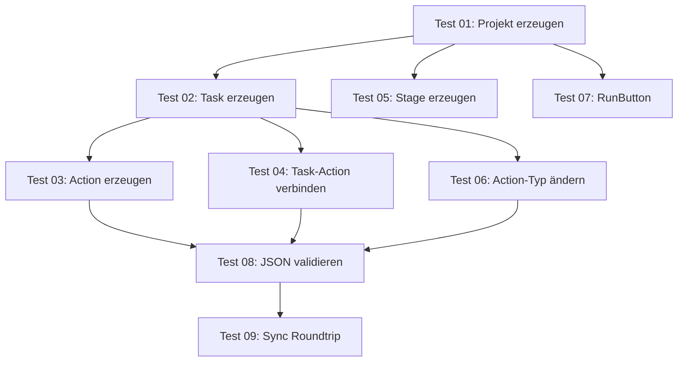

# E2E-Testplan — Detaillierte Aufstellung

## Übersicht

| # | Test-Datei | UseCase | Abhängigkeit | Status |
|---|---|---|---|---|
| 01 | [01_ProjectCreation.spec.ts](file:///c:/Users/rolfr/.gemini/antigravity/scratch/game-builder-v1/tests/e2e/01_ProjectCreation.spec.ts) | Neues Projekt erzeugen | – | ✅ |
| 02 | [02_TaskRenaming.spec.ts](file:///c:/Users/rolfr/.gemini/antigravity/scratch/game-builder-v1/tests/e2e/02_TaskRenaming.spec.ts) | Task erzeugen & umbenennen | 01 | ⚠️ In Arbeit |
| 03 | [03_ActionRenaming.spec.ts](file:///c:/Users/rolfr/.gemini/antigravity/scratch/game-builder-v1/tests/e2e/03_ActionRenaming.spec.ts) | Action erzeugen & umbenennen | 02 | ❌ |
| 04 | [04_TaskActionLinking.spec.ts](file:///c:/Users/rolfr/.gemini/antigravity/scratch/game-builder-v1/tests/e2e/04_TaskActionLinking.spec.ts) | Task→Action verbinden | 02 | ❌ |
| 05 | [05_StageCreation.spec.ts](file:///c:/Users/rolfr/.gemini/antigravity/scratch/game-builder-v1/tests/e2e/05_StageCreation.spec.ts) | Neue Stage erzeugen | 01 | ✅ |
| 06 | [06_ActionTypeChange.spec.ts](file:///c:/Users/rolfr/.gemini/antigravity/scratch/game-builder-v1/tests/e2e/06_ActionTypeChange.spec.ts) | Action-Typ ändern | 02 | ❌ |
| 07 | [07_RunButtonCreation.spec.ts](file:///c:/Users/rolfr/.gemini/antigravity/scratch/game-builder-v1/tests/e2e/07_RunButtonCreation.spec.ts) | RunButton auf Stage platzieren | 01 | ✅ |
| 08 | [08_ProjectSaving.spec.ts](file:///c:/Users/rolfr/.gemini/antigravity/scratch/game-builder-v1/tests/e2e/08_ProjectSaving.spec.ts) | Projekt speichern & JSON prüfen | 02–06 | ❌ |
| 09 | [09_SyncRoundtrip.spec.ts](file:///c:/Users/rolfr/.gemini/antigravity/scratch/game-builder-v1/tests/e2e/09_SyncRoundtrip.spec.ts) | Inspector↔JSON↔Flow↔Pascal Sync | 02–06 | ❌ |
| — | [deep_integration.spec.ts](file:///c:/Users/rolfr/.gemini/antigravity/scratch/game-builder-v1/tests/e2e/deep_integration.spec.ts) | Drag&Drop, Inspector, JSON-Sync | Eigenständig | ❌ |
| — | [editor_smoke.spec.ts](file:///c:/Users/rolfr/.gemini/antigravity/scratch/game-builder-v1/tests/e2e/editor_smoke.spec.ts) | Basis-Smoke-Test | – | ✅ |

---

## Test-Strategie

### Reihe 1: UI-Tests (User-Eingaben simulieren)
Alle Eingaben über echte Menü-Klicks und Inspector-Felder (`fill` + [Tab](file:///c:/Users/rolfr/.gemini/antigravity/scratch/game-builder-v1/src/editor/inspector/InspectorHost.ts#193-208)/`Enter`).

### Reihe 2: API-Tests (Programmatische Aufrufe)
Gleiche Ergebnisse über `editor.*` / `mediatorService.*` API — noch nicht implementiert.

Beide Reihen müssen am Ende **identische Ergebnisse** liefern.

---

## Detaillierte Schritte pro Test

### Test 01 — Neues Projekt erzeugen ✅

| # | User-Aktion | Selektor / Methode | Erwartetes Ergebnis |
|---|---|---|---|
| 1 | Menü: Datei → Neues Projekt | `.menu-bar-button:has-text("Datei")` → `.menu-item:has-text("Neues Projekt")` | Neues Projekt geladen |
| 2 | Initial-Validierung | `page.evaluate()` | `meta.name = "Neues Spiel"`, 3 Stages, Main leer |
| 3 | Inspector: Spielname | `input[name="gameNameInput"]` → `fill("MyCoolGame")` + Tab | `meta.name = "MyCoolGame"` |
| 4 | Inspector: Autor | `input[name="authorInput"]` → `fill("GCS-Team")` + Tab | `meta.author = "GCS-Team"` |
| 5 | Inspector: Beschreibung | `input[name="descriptionInput"]` → `fill(...)` + Tab | `meta.description` gesetzt |
| 6 | Inspector: Stage Name | `input[name="nameInput"]` → `fill("MainStage")` + Tab | `stage.name = "MainStage"` |
| 7 | Inspector: Grid (Spalten, Zeilen, Zellgröße) | `input[name="grid.colsInput"]` etc. | Grid-Werte korrekt |
| 8 | Dirty-Check | `isProjectChangeAvailable` | `true` nach jeder Änderung |
| 9 | Speichern | [saveMyCoolGame(page)](file:///c:/Users/rolfr/.gemini/antigravity/scratch/game-builder-v1/tests/e2e/helpers/loadMyCoolGame.ts#37-78) | `MyCoolGame.json` auf Disk |

---

### Test 02 — Task erzeugen & umbenennen ⚠️

| # | User-Aktion | Selektor / Methode | Erwartetes Ergebnis |
|---|---|---|---|
| 1 | MyCoolGame laden | [loadMyCoolGame(page)](file:///c:/Users/rolfr/.gemini/antigravity/scratch/game-builder-v1/tests/e2e/helpers/loadMyCoolGame.ts#12-36) | Projekt geladen |
| 2 | Tab: Flow klicken | `.tab-btn[data-view="flow"]` | Flow-Editor sichtbar |
| 3 | "+" Button klicken | Klick auf `+` neben Flow-Dropdown | Neuer Task-Flow erzeugt |
| 4 | Task-Node sichtbar | Flow-Canvas enthält Task-Node | Task "ANewTask" oder ähnlich |
| 5 | Task-Node anklicken | Klick auf den Node | Node selektiert, Inspector zeigt Eigenschaften |
| 6 | Inspector: Name ändern | `input[name="NameInput"]` → `fill("SwitchToTheHighscoreStage")` + Tab | Task umbenannt |
| 7 | Flow-Dropdown prüfen | `.flow-selector` enthält neuen Namen | Name aktualisiert |
| 8 | Speichern | [saveMyCoolGame(page)](file:///c:/Users/rolfr/.gemini/antigravity/scratch/game-builder-v1/tests/e2e/helpers/loadMyCoolGame.ts#37-78) | `MyCoolGame.json` mit neuem Task |

---

### Test 03 — Action erzeugen & umbenennen

| # | User-Aktion | Selektor / Methode | Erwartetes Ergebnis |
|---|---|---|---|
| 1 | MyCoolGame laden | [loadMyCoolGame(page)](file:///c:/Users/rolfr/.gemini/antigravity/scratch/game-builder-v1/tests/e2e/helpers/loadMyCoolGame.ts#12-36) | Projekt mit Task aus Test 02 |
| 2 | Flow-Editor öffnen | Tab: Flow | Flow-Ansicht |
| 3 | Task-Flow auswählen | Flow-Dropdown → `SwitchToTheHighscoreStage` | Flow geladen |
| 4 | Action-Node erstellen | Drag aus Toolbox oder [createNode('Action', ...)](file:///c:/Users/rolfr/.gemini/antigravity/scratch/game-builder-v1/src/editor/services/FlowNodeFactory.ts#39-188) | Action-Node im Canvas |
| 5 | Action benennen | Inspector: Name → `ShowTheHighscoreStage` | Action umbenannt |
| 6 | Prüfung: Manager-Tab | Actions-Liste enthält neuen Namen | Name sichtbar |
| 7 | Speichern | [saveMyCoolGame(page)](file:///c:/Users/rolfr/.gemini/antigravity/scratch/game-builder-v1/tests/e2e/helpers/loadMyCoolGame.ts#37-78) | JSON enthält Action |

---

### Test 04 — Task→Action verbinden

| # | User-Aktion | Selektor / Methode | Erwartetes Ergebnis |
|---|---|---|---|
| 1 | MyCoolGame laden | [loadMyCoolGame(page)](file:///c:/Users/rolfr/.gemini/antigravity/scratch/game-builder-v1/tests/e2e/helpers/loadMyCoolGame.ts#12-36) | Task + Action vorhanden |
| 2 | Flow: SwitchToTheHighscoreStage | Flow-Dropdown | Flow geladen |
| 3 | Task→Action verbinden | Connection via Output-Anker ziehen oder [restoreConnection()](file:///c:/Users/rolfr/.gemini/antigravity/scratch/game-builder-v1/src/editor/services/FlowGraphManager.ts#305-338) | Verbindung hergestellt |
| 4 | ActionSequence prüfen | `task.actionSequence` | `[{type: "action", name: "ShowTheHighscoreStage"}]` |
| 5 | Speichern | [saveMyCoolGame(page)](file:///c:/Users/rolfr/.gemini/antigravity/scratch/game-builder-v1/tests/e2e/helpers/loadMyCoolGame.ts#37-78) | JSON enthält actionSequence |

---

### Test 05 — Neue Stage erzeugen ✅

| # | User-Aktion | Selektor / Methode | Erwartetes Ergebnis |
|---|---|---|---|
| 1 | MyCoolGame laden | [loadMyCoolGame(page)](file:///c:/Users/rolfr/.gemini/antigravity/scratch/game-builder-v1/tests/e2e/helpers/loadMyCoolGame.ts#12-36) | Projekt geladen |
| 2 | Menü: Stages → Neue Stage | `.menu-bar-button:has-text("Stages")` → `.menu-item:has-text("Neue Stage")` | Neue Stage erstellt |
| 3 | Stage Name prüfen | Inspector | `stage_1` oder ähnlich |
| 4 | Speichern | [saveMyCoolGame(page)](file:///c:/Users/rolfr/.gemini/antigravity/scratch/game-builder-v1/tests/e2e/helpers/loadMyCoolGame.ts#37-78) | JSON enthält neue Stage |

---

### Test 06 — Action-Typ ändern

| # | User-Aktion | Selektor / Methode | Erwartetes Ergebnis |
|---|---|---|---|
| 1 | MyCoolGame laden | [loadMyCoolGame(page)](file:///c:/Users/rolfr/.gemini/antigravity/scratch/game-builder-v1/tests/e2e/helpers/loadMyCoolGame.ts#12-36) | Action vorhanden |
| 2 | Flow öffnen, Action selektieren | Klick auf Action-Node | Inspector zeigt Action |
| 3 | Typ ändern | Inspector: Typ-Dropdown → `navigate_stage` | Action-Typ geändert |
| 4 | Ziel-Stage setzen | Inspector: `stageId` → `HighscoreStage` | Property gesetzt |
| 5 | Speichern | [saveMyCoolGame(page)](file:///c:/Users/rolfr/.gemini/antigravity/scratch/game-builder-v1/tests/e2e/helpers/loadMyCoolGame.ts#37-78) | JSON enthält neuen Typ |

---

### Test 07 — RunButton erzeugen ✅

| # | User-Aktion | Selektor / Methode | Erwartetes Ergebnis |
|---|---|---|---|
| 1 | MyCoolGame laden | [loadMyCoolGame(page)](file:///c:/Users/rolfr/.gemini/antigravity/scratch/game-builder-v1/tests/e2e/helpers/loadMyCoolGame.ts#12-36) | Projekt geladen |
| 2 | Toolbox expandieren | Kategorie "Button" | Toolbox-Einträge sichtbar |
| 3 | Button auf Stage platzieren | Drag & Drop oder programmatisch | Button-Objekt auf Stage |
| 4 | Inspector: Caption | `caption` → `"run"` | Beschriftung gesetzt |
| 5 | Speichern | [saveMyCoolGame(page)](file:///c:/Users/rolfr/.gemini/antigravity/scratch/game-builder-v1/tests/e2e/helpers/loadMyCoolGame.ts#37-78) | JSON enthält Button |

---

### Test 08 — Projekt speichern & JSON validieren

| # | Prüfung | Erwartetes Ergebnis |
|---|---|---|
| 1 | `MyCoolGame.json` existiert | Datei auf Disk vorhanden |
| 2 | `meta.name` | `"MyCoolGame"` |
| 3 | `meta.author` | `"GCS-Team"` |
| 4 | Task `SwitchToTheHighscoreStage` | In `stages[main].tasks` vorhanden |
| 5 | Action `ShowTheHighscoreStage` | In `stages[main].actions` vorhanden |
| 6 | `actionSequence` | `ShowTheHighscoreStage` verlinkt |
| 7 | Alle Stages vorhanden | `main`, [blueprint](file:///c:/Users/rolfr/.gemini/antigravity/scratch/game-builder-v1/game-server/src/server.ts#1114-1115), ggf. `stage_1` |

---

### Test 09 — Sync Roundtrip

| # | Prüfung | Erwartetes Ergebnis |
|---|---|---|
| 1 | Inspector-Wert ändern (Action-Typ) | Wert im Inspector gesetzt |
| 2 | JSON prüfen | `project.actions` enthält neuen Typ |
| 3 | Flow prüfen | Node-Daten aktualisiert |
| 4 | Pascal-Code prüfen | Generierter Code korrekt |
| 5 | Roundtrip: Speichern → Laden | Identische Daten |

---

### Deep Integration Tests (Eigenständig)

| # | Szenario | Problem | Status |
|---|---|---|---|
| 1 | Panel Delete | Focus-Problem nach Löschung | ❌ |
| 2 | Flow-Editor Timeout | Drag-and-Drop Timing | ❌ |

---

## Abhängigkeits-Graph

