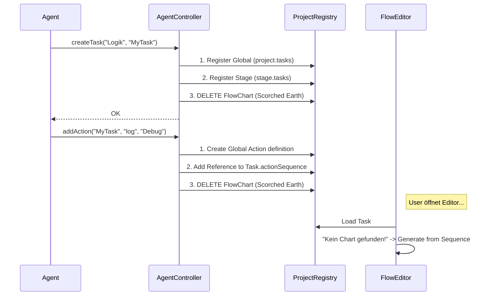

# AI Agent Controller API

## Status
**Status:** ✅ Implemented  
**Owner:** AgentController.ts  
**Version:** 1.0.0

## Übersicht
Der `AgentController` stellt eine **High-Level API** bereit, um GCS-Projekte programmatisch zu manipulieren. 
Sein Hauptzweck ist es, **AI-Agenten** (wie mir) eine sichere Schnittstelle zu geben, die strukturelle Integrität garantiert und historische Fehler (Inline-Actions, Ghost-Tasks) unmöglich macht.

## Workflow

## Kern-Prinzipien

1.  **Inverse Flow Generation**: 
    Der Agent bearbeitet *nie* das visuelle Diagramm (`flowChart`). Er bearbeitet nur die logische `actionSequence`. 
    Die API löscht bei jeder Änderung das Diagramm (`invalidateTaskFlow`). Der `FlowEditor` generiert es beim nächsten Laden automatisch neu.
    *Vorteil:* Garantierte Konsistenz zwischen Logik und Bild.

2.  **No Inline Actions**:
    Die API verbietet `actionSequence`-Items mit eingebetteten Daten. 
    Jede Action wird zuerst global in `project.actions` registriert und dann nur per Namen referenziert.
    *Vorteil:* Volle Kompatibilität mit dem Refactoring-Manager und Inspector.

3.  **Dual Registration**:
    Tasks werden atomar sowohl in `project.tasks` (Daten-Ebene) als auch in `stage.tasks` (Organisations-Ebene) eingetragen.
    *Vorteil:* Tasks tauchen sofort in allen Listen korrekt auf.

## API Reference

### `createTask(stageId: string, name: string, desc?: string)`
Erstellt einen neuen Task, verknüpft ihn mit der Stage und bereinigt alte Flow-Daten.

### `addAction(taskName: string, type: ActionType, actionName: string, params: object)`
Erstellt/Updating eine globale Action-Definition und fügt eine Referenz an das Ende des Tasks an.

## Beteiligte Dateien
- `src/services/AgentController.ts` (Core Logic)
- `scripts/test_agent_controller.ts` (Validation)
