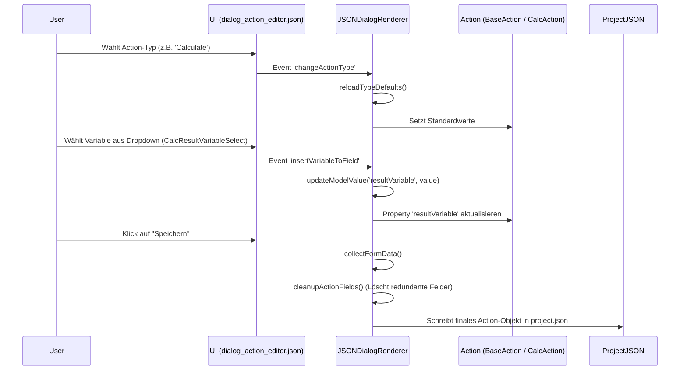

# UseCase: ActionParameterStandardisierung

## Beschreibung
Dieser UseCase beschreibt die Umstellung des Action-Systems auf eine konsistente OOP-Struktur (Standardisierung). Ziel ist ein "Gerader Weg" (Straight Path), bei dem UI-Feldnamen direkt den Properties im Datenmodell entsprechen, um Ad-hoc Mappings im Renderer zu vermeiden.

## Ablaufdiagramm

## Beteiligte Dateien & Methoden
- **JSONDialogRenderer.ts** (file:///c:/Users/rolfr/.gemini/antigravity/scratch/game-builder-v1/src/editor/JSONDialogRenderer.ts)
    - `updateModelValue(name, value)` (L1347-1420): Synchronisiert UI-Eingaben mit `dialogData`. Behandelt Spezialmappings wie `CalcResultVariable`.
    - `cleanupActionFields(type)` (L1064-1096): Bereinigt das Action-Objekt vor dem Speichern basierend auf dem gewählten Typ.
    - `handleAction(action, data)` (L827-990): Zentraler Dispatcher für UI-Events wie `save`, `updateValue` oder `insertVariableToField`.
    - `collectFormData()` (L1253-1290): Sammelt alle Werte aus dem Formularbag und startet den Speichervorgang.
    - `insertVariableToField(field, value)` (L1195-1203): Transferiert Variablennamen aus Dropdowns in Textfelder.

- **dialog_action_editor.json** (file:///c:/Users/rolfr/.gemini/antigravity/scratch/game-builder-v1/public/dialog_action_editor.json)
    - `VariableNameSelect` -> `actionData` (L154-157): Definiert Quell- und Zielfeld für den Variablen-Insert.
    - `CalcResultVariableSelect` -> `actionData` (L404-408): Mappt das Dropdown auf `resultVariable`.

- **StandardActions.ts** (file:///c:/Users/rolfr/.gemini/antigravity/scratch/game-builder-v1/src/runtime/actions/StandardActions.ts)
    - `registerStandardActions(objects)` (L21-478): Enthält die individuelle Logik für jeden Action-Typ (z.B. `calculate` ab L380).
    - `resolveTarget(...)` (L8-19): Löst Objekt-Strings (z.B. '${player}') in echte Referenzen auf.

## Datenfluss
- **Input**: Benutzereingaben in `TEdit` oder `TDropdown` im Action-Dialog.
- **Output**: Ein bereinigtes Action-Objekt (JSON), das den Interfaces in `types.ts` entspricht.

## Zustandsänderungen
- `dialogData`: Lokales Objekt im Renderer, das während der Bearbeitung den Zustand hält.
- `project.actions`: Das globale Array in der Projektdatei wird nach dem Speichern aktualisiert.

## Besonderheiten / Pitfalls
- **Input-Field im JSON**: Jedes Dropdown mit `insertVariableToField` MUSS ein `input`-Feld in `actionData` haben, das auf sich selbst zeigt, sonst kann der Renderer den Wert nicht auslesen.
- **Cleanup**: Neue Actions müssen in `cleanupActionFields` registriert werden, damit ihre spezifischen Properties nicht beim Speichern gelöscht werden.
