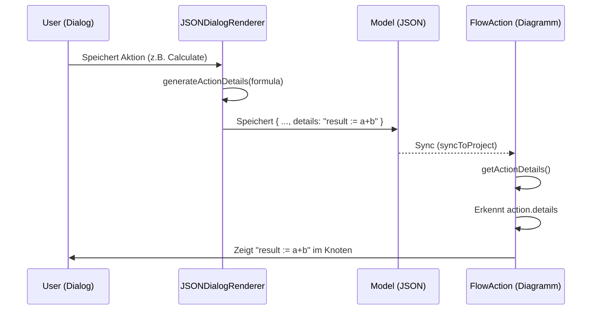

# Use Case: Action-Visualisierungs-Synchronisation

## Status
- **Datum**: 13.02.2026
- **Status**: Implementiert ✅
- **Ziel**: Konsistente Anzeige von Aktionsdetails im Flow-Editor durch Nutzung des JSON-Modells als Single Source of Truth.

## Beteiligte Komponenten

### 1. Datenquelle & Generator
- **Datei**: [JSONDialogRenderer.ts](file:///c:/Users/rolfr/.gemini/antigravity/scratch/game-builder-v1/src/editor/JSONDialogRenderer.ts)
- **Methode**: `generateActionDetails` (L1205)
- **Verantwortung**: Erzeugt beim Speichern einer Aktion im Dialog eine fachliche Beschreibung (Pascal-Syntax) und speichert diese im Action-Objekt unter der Property `details`.

### 2. Datenmodell (Persistence)
- **Datei**: `project.json` (bzw. In-Memory `GameProject`)
- **Property**: `action.details` (String)
- **Verantwortung**: Dient als persistente Schnittstelle zwischen Editor und Visualisierung.

### 3. Visualisierung (Consumer)
- **Datei**: [FlowAction.ts](file:///c:/Users/rolfr/.gemini/antigravity/scratch/game-builder-v1/src/editor/flow/FlowAction.ts)
- **Methode**: `getActionDetails` (L306)
- **Verantwortung**: 
    - Priorisiert das Feld `action.details` aus dem Projekt-Modell (Single Source of Truth).
    - Führt Interpolation für "Ghost Nodes" (Library Tasks) durch.
    - Bietet Fallback-Logik, falls das `details`-Feld fehlt (z.B. nach manuellen Code-Änderungen).

## Datenfluss (Sequenz)

## Besonderheiten
- **Ghost Nodes**: In Library-Tasks werden die `details` zur Laufzeit visualisiert, indem die Parameter in den `details`-String (template) interpoliert werden.
- **Gerade Linie**: Die Logik zur Generierung liegt zentral im Renderer; der Flow-Editor ist ein reiner Konsument.
