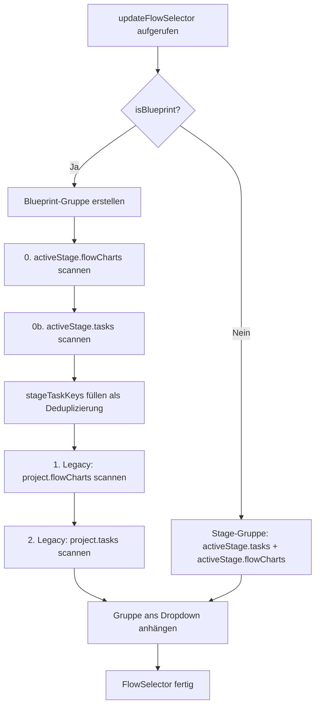

# UseCase: Blueprint Flow-Dropdown (v3.3.14)

## Überblick
Dieses Dokument beschreibt, wie der `FlowEditor` beim Wechsel zur Blueprint-Stage die verfügbaren Flows (Tasks/FlowCharts) im Dropdown-Menü zusammenstellt und warum die ursprüngliche Implementierung Blueprint-eigene Tasks (z.B. `AttemptLogin`) nicht anzeigte.

---

## Problem (vor v3.3.14)

### Symptom
Nach dem Entfernen des Mermaid-Diagramm-Mechanismus (v3.3.13) zeigte der Flow-Tab auf der Blueprint-Stage ein leeres bzw. unvollständiges Dropdown. Tasks wie `AttemptLogin`, die in `stage_blueprint.tasks` definiert sind, fehlten.

### Ursache
`FlowEditor.updateFlowSelector()` (Datei: `FlowEditor.ts`, Methode `updateFlowSelector`, ca. L535–576) enthielt für den Blueprint-Zweig (`isBlueprint === true`) nur einen Scan über `project.flowCharts` und `project.tasks` (Root-Level-Legacy). Die stage-eigene Kollektion `stage_blueprint.tasks` und `stage_blueprint.flowCharts` wurde vollständig ignoriert.

```typescript
// ALT (fehlerhaft):
// 1. Global tasks with flowchart  ← scannte nur project.flowCharts
// 2. Global tasks without flowchart ← scannte nur project.tasks
// stage_blueprint.tasks / .flowCharts wurden NICHT berücksichtigt!
```

---

## Lösung (v3.3.14)

### Datei & Methode
- **Datei:** `src/editor/FlowEditor.ts`
- **Methode:** `updateFlowSelector()` (L535–605)

### Änderung
Der Blueprint-Zweig wurde um **zwei neue Blöcke** erweitert, die VOR den Legacy-Blöcken ausgeführt werden:

```typescript
// 0. Blueprint-Stage-eigene FlowCharts (SSoT für globale Tasks)
if (activeStage?.flowCharts) {
    Object.keys(activeStage.flowCharts).forEach(key => {
        if (key !== 'global') {
            const opt = document.createElement('option');
            opt.value = key;
            opt.text = `Task: ${key}`;
            opt.selected = this.currentFlowContext === key;
            globalGroup.appendChild(opt);
            globalTasksFound.add(key);
        }
    });
}

// 0b. Blueprint-Stage-eigene Tasks ohne FlowChart
if (activeStage?.tasks) {
    activeStage.tasks.forEach(task => {
        if (!globalTasksFound.has(task.name)) {
            const opt = document.createElement('option');
            opt.value = task.name;
            opt.text = `Task: ${task.name}`;
            opt.selected = this.currentFlowContext === task.name;
            globalGroup.appendChild(opt);
            globalTasksFound.add(task.name);
        }
    });
}
```

**Danach** folgt die `stageTaskKeys`-Deduplication, die verhindert, dass Blueprint-Tasks noch einmal als Legacy-Global-Tasks auftauchen.

---

## Datenfluss



---

## Beteiligte Dateien & Methoden

| Datei | Methode | Zeilen | Rolle |
|---|---|---|---|
| `src/editor/FlowEditor.ts` | `updateFlowSelector()` | L535–605 | Dropdown-Aufbau (geändert) |
| `src/editor/FlowEditor.ts` | `setProject()` | L335–381 | Ruft `updateFlowSelector()` auf |
| `src/editor/FlowEditor.ts` | `getActiveStage()` | L133–136 | Liefert aktive Stage-Definition |
| `src/editor/FlowEditor.ts` | `loadFromProject()` | L916–1068 | Lädt Flow-Daten nach Dropdown-Auswahl |

---

## Datenmodell (SSoT)

```
project.stages[]
  └── stage_blueprint  (type: 'blueprint')
        ├── tasks[]          ← Primär-Speicherort globaler Tasks (z.B. AttemptLogin)
        ├── actions[]        ← Primär-Speicherort globaler Actions
        └── flowCharts{}     ← Key = Task-Name, Value = { elements[], connections[] }
              └── "AttemptLogin" → { elements: [...], connections: [...] }
```

**Hosting-Regel (DEVELOPER_GUIDELINES.md §Hosting-Regeln):**
- Globale Tasks → `stage_blueprint.tasks` ✅
- Globale Actions → `stage_blueprint.actions` ✅
- Globale FlowCharts → `stage_blueprint.flowCharts` ✅
- Root-Level (`project.tasks`, `project.flowCharts`) → nur Legacy/Fallback

---

## Zustandsänderungen

| Zeitpunkt | State |
|---|---|
| Vor Fix | Blueprint-Dropdown leer / zeigt nur `project.tasks` |
| Nach Fix | Blueprint-Dropdown zeigt `stage_blueprint.tasks` + `stage_blueprint.flowCharts` zuerst, dann Legacy |
| `currentFlowContext` | Wird über `opt.selected = this.currentFlowContext === key` vorausgewählt |

---

## Vorher/Nachher (Blueprint-Stage, Flow-Tab)

**Vorher:**
```
🔷 Global / Projekt (Infrastruktur)
  (leer, da stage_blueprint.tasks ignoriert wurde)
```

**Nachher:**
```
🔷 Blueprint / Global
  ├── Task: AttemptLogin
  ├── Task: InitApp
  └── Task: HandleError
```

---

## Verwandte Fixes (chronologisch)

| Version | Fix |
|---|---|
| v3.3.11 | Stage-wrapper Sichtbarkeits-Trennung (Stage- vs. Flow-Tab) |
| v3.3.12 | `isStageOrRunView`-Guard in `Editor.render()` |
| v3.3.13 | Mermaid-Diagramm-Mechanismus (`#blueprint-viewer`) entfernt |
| **v3.3.14** | **`updateFlowSelector()` Blueprint-Zweig repariert** |

---

## DO NOT (Lessons Learned)

- ❌ **Niemals** nur `project.tasks` oder `project.flowCharts` für Blueprint-Tasks scannen — das ist das veraltete Root-Level-Schema.
- ❌ **Niemals** `stage_blueprint` als Sonderfall für Anzeige ausschließen — sie ist eine vollwertige Stage mit eigenen Tasks/FlowCharts.
- ✅ **Immer** `activeStage.tasks` + `activeStage.flowCharts` vor Legacy-Arrays prüfen.
- ✅ **Deduplication obligatorisch**: `stageTaskKeys` verhindert, dass Tasks doppelt erscheinen.
