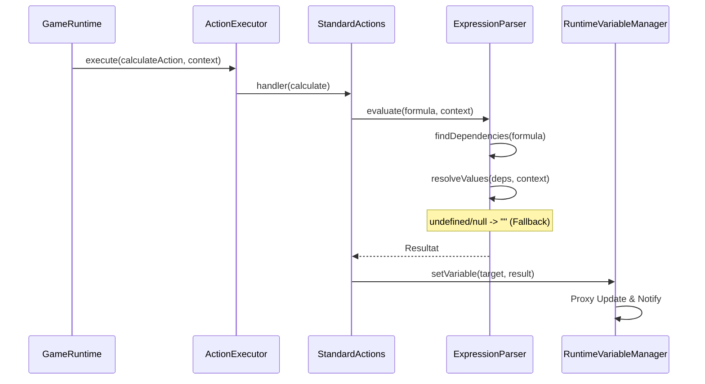

# UseCase: executeCalculateVariable

## Beschreibung
Dieser UseCase beschreibt die Ausführung einer Rechenoperation (Aktion vom Typ `calculate`), die Werte aus Objekten und Variablen kombiniert und das Ergebnis in einer Ziel-Variable speichert.
Besonderer Fokus liegt auf der Robustheit gegenüber Proxies (Laufzeitvariablen) und der Vermeidung von `undefined`-Ausgaben in der Benutzeroberfläche.

## Ablaufdiagramm

## Beteiligte Dateien & Methoden
- **StandardActions.ts** (file:///c:/Users/rolfr/.gemini/antigravity/scratch/game-builder-v1/src/runtime/actions/StandardActions.ts)
    - `calculate Handler` (L122-L162): Registriert die Aktion. Unterstützt `formula` und `expression`. Synchronisiert Ergebnisse sowohl im globalen Kontext (`contextVars`) als auch in lokalen Task-Variablen (`vars`).
- **ExpressionParser.ts** (file:///c:/Users/rolfr/.gemini/antigravity/scratch/game-builder-v1/src/runtime/ExpressionParser.ts)
    - `evaluate(expression, context)` (L123-L165): Führt die eigentliche Berechnung durch. Nutzt `extractDependencies`, um Variablen auch in Proxies zu finden.
    - `extractDependencies(expression)` (L204-L212): Identifiziert verwendete Variablen-Namen per Regex.
- **RuntimeVariableManager.ts** (file:///c:/Users/rolfr/.gemini/antigravity/scratch/game-builder-v1/src/runtime/RuntimeVariableManager.ts)
    - `createVariableContext()` (L86-L157): Erstellt den Proxy für `contextVars`. Wichtig: Der Parser muss Abhängigkeiten manuell prüfen, da der Proxy nicht alle Schlüssel proaktiv via `Object.keys()` meldet.

## Datenfluss
- **Input**: `formula` (String, z.B. "score + 10"), `resultVariable` (Zielname), `context` (Objekte & Variablen).
- **Output**: Aktualisierte Variable im `RuntimeVariableManager`, ggf. Update von UI-Komponenten (Reaktivität).

## Zustandsänderungen
- `contextVars[target] = undefined` -> `contextVars[target] = result`
- UI Sync: `PinDisplay.text = "PIN: "` -> `PinDisplay.text = "PIN: 🍎"`

## Besonderheiten / Pitfalls
- **Proxy Visibility**: Da `contextVars` ein Proxy ist, liefert `Object.keys()` möglicherweise leere Ergebnisse für noch nicht gesetzte Variablen. Daher ist die statische Analyse der Formel (Dependencies) zwingend erforderlich.
- **Undefined-Safe**: JavaScript berechnet `undefined + "🍎"` als `"undefined🍎"`. Der `ExpressionParser` fängt dies ab, indem er `undefined/null` Eingangsgrößen in leere Strings umwandelt.
- **Alias Support**: Im Projekt-JSON können sowohl `formula` als auch `expression` verwendet werden. Der Code unterstützt beide Varianten.
