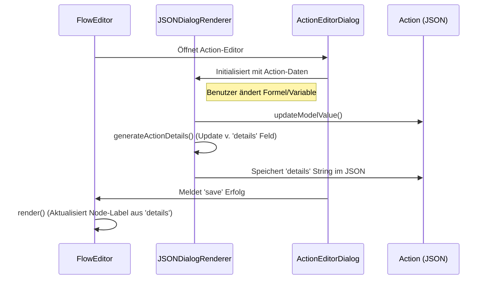

# UseCase: FlowEditorDetailAnzeige

## Beschreibung
Dieser UseCase beschreibt, wie die detaillierte Textanzeige für Aktionen im Flow-Editor generiert wird. Jede Aktion im Flow-Editor kann eine Kurzbeschreibung (Details) anzeigen, die automatisch aktualisiert wird, wenn die Aktion im Dialog bearbeitet wird.

## Ablaufdiagramm

## Beteiligte Dateien & Methoden
- **JSONDialogRenderer.ts** (file:///c:/Users/rolfr/.gemini/antigravity/scratch/game-builder-v1/src/editor/JSONDialogRenderer.ts)
    - `generateActionDetails(action)` (L1205-1251): Die Kernmethode, die basierend auf dem Action-Typ einen lesbaren String generiert.
    - `collectFormData()` (L1253-1290): Ruft `generateActionDetails` auf, bevor der Dialog geschlossen wird, um sicherzustellen, dass die Anzeige aktuell ist.
- **FlowAction.ts** (file:///c:/Users/rolfr/.gemini/antigravity/scratch/game-builder-v1/src/editor/FlowAction.ts)
    - Stellt die visuelle Komponente bereit, die den `details`-Text aus dem JSON-Objekt anzeigt.

## Datenfluss
- **Input**: Die aktuellen Properties einer Aktion (`formula`, `variableName`, `target`, etc.).
- **Output**: Ein formatierter String (z.B. `currentPIN := currentPIN + PinPicker.selectedEmoji`), der im Feld `details` der Aktion gespeichert wird.

## Zustandsänderungen
- `action.details`: Dieser String wird im Action-Objekt innerhalb der `actionSequence` persistiert, damit der Flow-Editor ihn ohne Neuberechnung anzeigen kann.

## Besonderheiten / Pitfalls
- **Platzhalter**: Falls Felder wie `formula` noch leer sind, wird ein Fallback wie `(Berechnung)` angezeigt.
- **Abwärtskompatibilität**: Die Logik behandelt sowohl neue Property-Namen (`variableName`) als auch alte Namen (`variable`), um bestehende Projekte nicht zu brechen.
