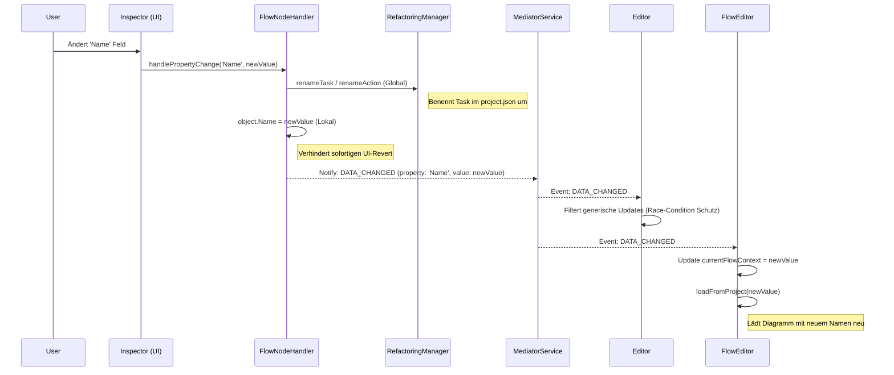

# UseCase: FlowEditor Rename-Synchronisation (Robust Rename)

## Beschreibung
Dieser UseCase beschreibt die robuste Synchronisation von Umbenennungen (Tasks und Actions) zwischen dem Inspector, dem Projekt-Datenmodell und der visuellen Darstellung im Flow-Editor. Ziel ist es, Race-Conditions zu vermeiden, die zu UI-Resets ("Springen" zur Startseite), Datenverlust oder asynchronen Anzeigen führen.

## Ablaufdiagramm

## Beteiligte Dateien & Methoden

### 1. Inspector-Schicht
- **[FlowNodeHandler.ts](file:///c:/Users/rolfr/.gemini/antigravity/scratch/game-builder-v1/src/editor/inspector/handlers/FlowNodeHandler.ts)**
    - `handlePropertyChange()` (L30-L50): Identifiziert Umbenennungen. 
    - **Fix**: Nutzt nun explizit den `Name`-Setter des Flow-Elements, um das lokale UI-Objekt zu aktualisieren, bevor das globale Refactoring startet. Dies verhindert, dass der Inspector beim nächsten Render-Zyklus (getriggert durch den Renaming-Event) den alten Wert aus dem noch nicht aktualisierten Proxy liest.

### 2. UI-Host & Event-Propagation
- **[InspectorHost.ts](file:///c:/Users/rolfr/.gemini/antigravity/scratch/game-builder-v1/src/editor/inspector/InspectorHost.ts)**
    - Reicht nun spezifische `PropertyChangeEvent`-Daten an den globalen Editor weiter, anstatt nur ein generisches "updated" zu senden.
- **[Editor.ts](file:///c:/Users/rolfr/.gemini/antigravity/scratch/game-builder-v1/src/editor/Editor.ts)**
    - `onObjectUpdate(event)` (L2465): Verhindert das Senden eines zusätzlichen generischen `DATA_CHANGED` Events, wenn bereits ein spezifischer Renaming-Event unterwegs ist. Dies unterbindet Race-Conditions im `MediatorService` (Debouncing).

### 3. Flow-Editor Schicht
- **[FlowEditor.ts](file:///c:/Users/rolfr/.gemini/antigravity/scratch/game-builder-v1/src/editor/FlowEditor.ts)**
    - `initMediator()` (L2701): Reagiert auf Renaming-Events.
    - **Kritischer Fix**: Wenn der aktuell geöffnete Task umbenannt wurde, wird `loadFromProject(data.value)` aufgerufen. Dies erzwingt ein Neuladen des Canvas mit den frisch vom `RefactoringManager` aktualisierten Daten und verhindert, dass der Editor in einem ungültigen Zustand (alter Name) verharrt.

## Technische Details & Fixes

### Getter/Setter Falle
Ein zentrales Problem war die Verwendung von `object.name` vs `object.Name` in `FlowElement.ts`. 
- `name` (kleingeschrieben) ist ein **Read-only Getter** (liefert die ID).
- `Name` (großgeschrieben) ist der **Getter/Setter für den Anzeigenamen** und triggert die interne Logik.
Der Fix in `FlowNodeHandler.ts` stellt sicher, dass der Setter verwendet wird, um einen `TypeError` beim versuchten Schreibzugriff auf den Getter zu vermeiden.

### Race-Condition Schutz
Durch das Debouncing im `MediatorService` konnten schnelle Abfolgen von Events (Spezifisches Rename -> Generisches Update) dazu führen, dass die wichtigeren Rename-Informationen (`oldValue`, `newValue`) durch ein leeres generisches Update überschrieben wurden. Die selektive Event-Unterdrückung im `Editor.ts` löst dieses Problem.

## Datenfluss bei Umbenennung
1. **Input**: Tastatureingabe im Inspector Name-Feld.
2. **Transform**: `RefactoringManager` bereinigt alle Referenzen in Tasks und Stages (Sequentialisierung).
3. **Sync**: `MediatorService` verteilt den neuen Kontext.
4. **Output**: Flow-Editor Dropdown aktualisiert sich, Canvas wird neu gezeichnet, `localStorage` (last_context) wird aktualisiert.

## Besonderheiten / Pitfalls
- **View-Reset**: Ohne das präzise Context-Update in `FlowEditor.ts` würde das System bei einer Umbenennung versuchen, den alten (gelöschten) Task-Namen zu laden, was oft in einem Fallback auf die "Mainpage" oder einen leeren Canvas endete.
- **Async-Refactoring**: Das Refactoring ist synchron im Datenmodell, aber asynchron in der UI-Reaktion. Der explizite Reload im `FlowEditor` überbrückt diese Lücke.
