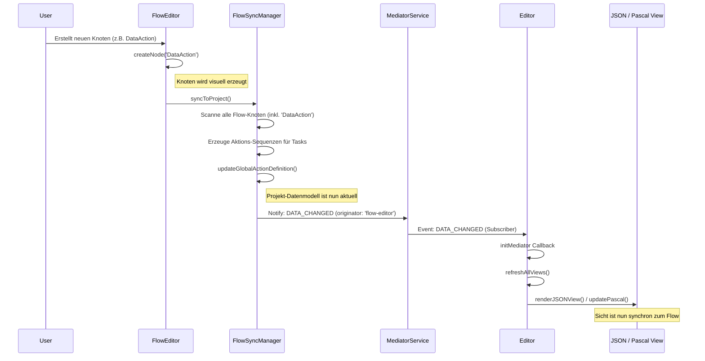

# UseCase: Sofortige JSON-Synchronisation und Persistenz-Sicherung

## Beschreibung
Dieser Usecase beschreibt den Mechanismus, der sicherstellt, dass Änderungen im Flow-Editor (insbesondere das Erstellen neuer `DataAction`-Knoten) unmittelbar und ohne Verzögerung im JSON-Modell und in allen anderen Sichten (Pascal-Editor, Tree-Viewer) reflektiert werden. Dies wird durch eine "Trinity-Sync"-Architektur erreicht, bei der der Flow-Editor den Sync triggert und der Haupt-Editor auf die resultierenden Mediator-Events mit einem globalen Refresh reagiert.

## Ablaufdiagramm

## Beteiligte Dateien & Methoden

### 1. Flow Editor Schicht
- **[FlowEditor.ts](file:///c:/Users/rolfr/.gemini/antigravity/scratch/game-builder-v1/src/editor/FlowEditor.ts)**
    - `createNode(type, ...)` (L1145-L1280): Erzeugt den visuellen Knoten und ruft am Ende obligatorisch `this.syncToProject()` auf.
    - `syncToProject()` (L865-L875): Delegiert die Persistenz an den `FlowSyncManager`.

### 2. Synchronisations Schicht
- **[FlowSyncManager.ts](file:///c:/Users/rolfr/.gemini/antigravity/scratch/game-builder-v1/src/editor/services/FlowSyncManager.ts)**
    - `syncToProject(context)` (L77-L166): Hauptmethode zur Überführung des Flows in das Datenmodell. 
        - **Fix (v2.16.23)**: Die Iteration über Knoten wurde erweitert, um auch den Typ `'DataAction'` zu erfassen (L112), damit neue Daten-Aktionen sofort im Projekt registriert werden.
    - `updateGlobalActionDefinition(data)` (L607-L650): Aktualisiert oder erstellt die Aktion im `project.actions` Array oder in der lokalen Stage.
    - `mediatorService.notify(DATA_CHANGED, ...)` (L164): Benachrichtigt das Gesamtsystem über die Datenänderung.

### 3. Integrations Schicht (Core)
- **[Editor.ts](file:///c:/Users/rolfr/.gemini/antigravity/scratch/game-builder-v1/src/editor/Editor.ts)**
    - `initMediator()` (L2339-L2348): Abonniert `DATA_CHANGED`.
        - **Fix (v2.16.23)**: Reagiert auf den Originator `'flow-editor'` nun mit `refreshAllViews()` anstatt nur mit einem einfachen `render()` (das nur die Stage gezeichnet hätte).
    - `refreshAllViews(originator)` (L1874-L1891): Das Herzstück der Synchronisation. Aktualisiert die visuelle Stage, den JSON-Baum (`refreshJSONView`), die verfügbaren Aktionen und den Pascal-Editor.

## Struktur-Besonderheiten: Lineare vs. Branching Actions
Ein kritischer Unterschied in der Speicherung liegt in der Art der Einbindung in die `actionSequence` eines Tasks:

- **Lineare Actions (Standard)**: Werden nur als Referenz gespeichert: `{ "type": "action", "name": "ActionName" }`. Die eigentliche Logik lebt ausschließlich in `project.actions`.
- **Branching Actions (DataAction / Condition)**: Werden als "Container" in der Sequenz gespeichert.
    - Sie besitzen einen `successBody` und `errorBody` (bzw. `body` und `elseBody`), welche die nachfolgende Logik-Kette als verschachteltes Array enthalten.
    - Bei `DataActions` werden zudem alle Konfigurationsdaten (URL, Resource, etc.) direkt in das Sequenz-Item kopiert (Sicherung der Ausführbarkeit), während sie gleichzeitig als globale Definition in `project.actions` verwaltet werden.

## Lösch-Synchronisation (Smart-Delete)
Das System stellt sicher, dass verwaiste Aktions-Definitionen die `project.json` nicht aufblähen:
- Beim Löschen eines `Action`- oder `DataAction`-Knotens im Flow-Canvas wird geprüft, ob dies die letzte Referenz auf diese Aktion im gesamten Projekt ist.
- **Auto-Cleanup**: Generische Namen (`DataAction1`, `HttpAction2`, `Action42`) werden bei der letzten Löschung sofort und automatisch aus der globalen/Stage-Aktionsliste entfernt.
- **Manuelle Bestätigung**: Bei benannten Aktionen (z. B. "LoginRequest") fragt das System den Benutzer, ob auch die globale Definition gelöscht werden soll.

## Datenfluss
- **Input**: Benutzerinteraktion im Flow-Canvas (Knoten erstellen, löschen, verbinden).
- **Output**: Ein aktualisierter JSON-Baum im `JSONTreeViewer` und eine konsistente `project.json` im Arbeitsspeicher des Browsers/LocalStorage.

## Zustandsänderungen
- **Flow-State**: Visueller Knoten wurde hinzugefügt (lokaler Zustand `FlowEditor`).
- **Project-State**: `project.actions` enthält das neue Aktions-Objekt mit Standard-Werten.
- **View-State**: `JSON-Viewer` Node wurde via `refreshJSONView` neu gerendert.

## Besonderheiten / Pitfalls
- **Typ-Vollständigkeit**: Der `FlowSyncManager` muss jeden neuen Knoten-Typ explizit in seiner `syncToProject`-Schleife unterstützen, da er sonst nicht in die globalen Listen (`actions`/`tasks`) des Projekts wandert.
- **Originator-Schutz**: Um Endlosschleifen zu vermeiden (z.B. JSON-Editor ändert Daten -> triggert Sync -> JSON-Editor rendert neu), prüft `Editor.initMediator` den `originator`. Der JSON-Editor wird bei Änderungen vom Flow-Editor jedoch *bewusst* neu gerendert.
- **Trace-Logging**: Die in v2.16.23 eingeführten Logs (`[FlowEditor]`, `[FlowSyncManager]`, `[Editor]`) dienen als wichtiges Diagnosewerkzeug, um die Kette bei Fehlern zu debuggen.
