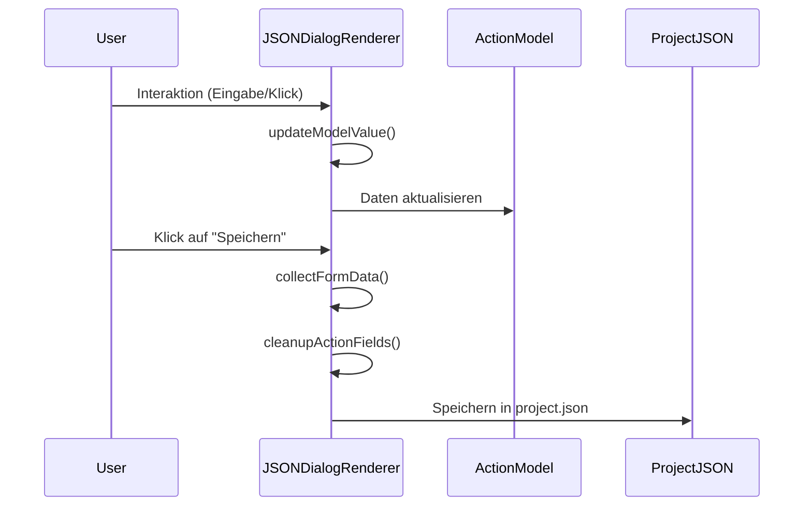

# UseCase: [Name]

## Beschreibung
[Kurze Beschreibung des fachlichen und technischen Ziels]

## Ablaufdiagramm

## Beteiligte Dateien & Methoden
- **[Dateiname]** (file:///[Absoluter/Pfad])
    - `methodName(params)` (LStart-LEnd): [Präzise Beschreibung der Aufgabe]. Zeilennummern dienen als Anker für die schnelle Suche.

## Datenfluss
- **Input**: [Welche Daten/Events triggern den Prozess?]
- **Output**: [Was ist das persistente Ergebnis?]

## Zustandsänderungen
- [Zustand A] -> [Zustand B]

## Besonderheiten / Pitfalls
- [Wichtige Hinweise für Entwickler]
